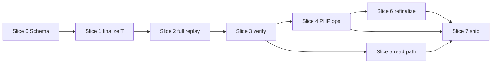

# Amiga tournament finalize — sliced implementation plan

**Status:** **Complete** (Jun 2026) — slices 0–7 shipped; staging 24-part import verified on `ratings.kickoff2.com`  
**Contract:** [`amiga-tournament-finalize-rating-contract.md`](amiga-tournament-finalize-rating-contract.md) — **what** we built  
**This document:** **how** it was built, in order, with stop/report rules (historical record)

---

## 1. Goals

1. Replace per-game global derived commit with **tournament finalize** as the only commit boundary.
2. Ship a **working full path**: schema → Python replay oracle → PHP live ops → website read path → refinalize for corrections.
3. **No hero fixes:** each slice ends in a report; blockers get a measured discussion before scope creep or destructive repair.

---

## 2. Working rules (all slices)

### 2.1 In scope for any agent

- Changes required by the current slice and contract.
- Small bugs found **within** the slice (typos, wrong column name, off-by-one in verify).
- Tests/verify commands listed for that slice.
- Documentation updates listed for that slice.

### 2.2 Stop and report (do not “fix at any cost”)

Pause the slice and report to Dagh when any of these occur:

| Situation | Action |
|-----------|--------|
| Full replay fails or verify identities fail after **focused** debugging | Stop; report symptoms + hypothesis; propose options |
| Ratings/stats diverge from contract invariants (§ 5.9) | Stop; do not patch with ad hoc per-game global commit |
| Schema migration cannot apply on local DB without data loss not in plan | Stop; propose migration path |
| PHP/Python parity mismatch on same tournament | Stop if not a trivial typo; compare outputs and report |
| Need to change Elo formula, K-factor, or chronology contract | Stop — out of scope |
| Need to revert unrelated user changes or force-push | Stop — ask Dagh |
| Slice would exceed agreed scope to “just make it green” | Stop; request slice split or contract amendment |

### 2.3 Forbidden without explicit approval

- `git push --force`, hard reset, rewriting history on `main`
- Disabling verify/hooks to green CI
- Restoring per-game global rating commit as a “temporary” workaround
- Large refactors outside the slice (CSS, fixtures UI, unrelated ops)
- Editing `koatd.mdb` or production/staging data directly

### 2.4 Slice completion report (required every slice)

Post to Dagh (chat or handoff doc under `docs/orchestration/agent-handoffs/`) with:

```markdown
## Slice N complete — [title]

**Commit:** `<hash>` (pushed: yes/no)

### Done
- [bullets matching slice checklist]

### Verification
| Command | Result |
|---------|--------|
| ... | pass / fail |

### Contract invariants checked
- [ ] rating_event chain: E2.rating_before = E1.rating_after (sample or full)
- [ ] SUM(game adjustments) = event rating_delta (sample)
- [ ] game_ratings count = games count (for finalized tournaments)

### Known limitations (this slice)
- ...

### Risks / follow-ups for next slice
- ...

### Blocked items (if any)
- None / description
```

**Do not start slice N+1 until Dagh acknowledges slice N** (brief “go on” is enough).

---

## 3. Baseline before Slice 0

**One-time prep** (can be same session as Slice 0):

```powershell
# Confirm local DB and current oracle (pre-change — for comparison only)
python -m scripts.amiga verify-chronology
python -m scripts.amiga replay --dry-run
# Optional: record counts after full replay on current main for before/after notes
```

Note: after Slice 3, **numeric ratings will differ** from the old model. Do not use old rating values as parity oracle.

---

## 4. Slice overview

| Slice | Title | Delivers | Old replay still runs? |
|-------|--------|----------|-------------------------|
| **0** | Schema & derived reset | Tables, flags, extended `clear_derived` | Yes (unchanged code) |
| **1** | Python `finalize_tournament` (single event) | One-tournament primitive + CLI | Yes |
| **2** | Python full replay switch | Tournament-order replay oracle | **No** — new oracle |
| **3** | Verify & contract wiring | `verify-rating-events`, docs, PROJECT_MEMORY | New oracle only |
| **4** | PHP finalize + live ops | Ops finalize, no global write on result entry | New oracle |
| **5** | Read path | Charts, API, game page rating display | End-to-end product |
| **6** | Refinalize & corrections | Reopen, cascade refinalize | Ops complete |
| **7** | Staging parity & cleanup | Export, README, retire dead paths | Ship |

Slices 0–3 = **batch/historical path working**. Slices 4–6 = **live path + corrections**. Slice 7 = **deployable**.

---

## 5. Slice 0 — Schema & derived reset

### Objective

Add schema for rating events and finalize markers **without** changing replay behaviour yet.

### Tasks

- [ ] Add `scripts/amiga/sql/009_rating_events.sql`:
  - `amiga_rating_events` (per contract § 7.2)
  - `tournaments.rating_finalized`, `tournaments.rating_finalized_at`
- [ ] Wire into `import --recreate-schema` path / document manual apply for existing DBs
- [ ] Extend `clear_derived()` in `replay.py`:
  - `DELETE FROM amiga_rating_events`
  - Reset `tournaments.rating_finalized = 0`, `rating_finalized_at = NULL`
- [ ] **Policy lock:** `amiga_games.tournament_id IS NULL` — document in contract: treat as error on import verify, or attach to synthetic tournament (pick one; recommend: fail `verify-rating-events` if any NULL tournament_id on rated games)

### Exit criteria

- [ ] Migration applies on local `ko2amiga_db` without error
- [ ] `python -m scripts.amiga import --recreate-schema` + **existing** `replay` still completes (old behaviour)
- [ ] `clear_derived` clears new table and resets flags
- [ ] No PHP changes required

### Verify

```powershell
python -m scripts.amiga import --recreate-schema
python -m scripts.amiga replay --limit 500
python -m scripts.amiga verify-chronology
```

### Risk notes

- Import recreates schema — confirm `009` is in the recreate bundle.

---

## 6. Slice 1 — Python `finalize_tournament` (single event)

### Objective

Implement and prove `finalize_tournament(T)` for **one tournament** in isolation. Do not switch full replay yet.

### Tasks

- [ ] New module `scripts/amiga/finalize_tournament.py` implementing contract § 5
- [ ] `PlayerState` / `apply_game_row` support:
  - `commit_rating: bool = True` — when `False`, skip `self.rating = new_rating` and skip `_apply_career_peak_nadir` during batch
  - Opponent average uses **frozen** opponent rating passed in (already partially via `opponent_rating_before`)
- [ ] `apply_game_row_frozen(...)` or parameters: `frozen_ratings: dict[int, float]`, `commit_rating=False`
- [ ] Per game: write `amiga_game_ratings` with frozen `rating_a/b`, `adjustment_a/b`; leave `new_rating_a/b` NULL in slice 1
- [ ] Batch end: sum adjustments → `amiga_rating_events` → update `amiga_player_stats.Rating`
- [ ] After all players in batch: recompute **rating** `PeakRating` / `LowestRating` from that player’s rating events chronology (helper `recompute_rating_peaks_from_events(player_id)`)
- [ ] CLI: `python -m scripts.amiga finalize-tournament --tournament-id=N [--dry-run]`
- [ ] Pick **3 canonical test tournaments** (record IDs in handoff):
  - Smallest (1–5 games)
  - Medium Swiss/group (~20+ games)
  - Same-day pair (cup + main, different chrono) — two separate finalize calls

### Exit criteria

- [ ] Manual finalize on test tournaments: row counts match (games ↔ `amiga_game_ratings`)
- [ ] For each test player: `SUM(adjustments) = rating_delta` in event row
- [ ] `rating_after = rating_before + rating_delta`
- [ ] Second finalize on same T without reopen → error or no-op (idempotent guard)
- [ ] Full replay **not** switched yet

### Verify

```powershell
python -m scripts.amiga clear-derived   # or replay's clear step
# Seed: run old replay OR manually ensure amiga_player_stats empty + bootstrap 1600
python -m scripts.amiga finalize-tournament --tournament-id=<small>
python -m scripts.amiga finalize-tournament --tournament-id=<medium>
# Ad-hoc SQL or stub verify script for § 5.9 on those tournaments
```

### Stop conditions

- Frozen rating leaks (global rating changes mid-batch) — stop; do not revert to per-game global commit.

---

## 7. Slice 2 — Python full replay switch

### Objective

Replace game-at-a-time global replay with **tournament-order finalize loop**. This becomes the **new batch oracle**.

### Tasks

- [ ] `replay.py`: replace inner game loop with:
  ```text
  tournaments ORDER BY event_date ASC, chrono ASC
  for T with games: finalize_tournament(T)
  ```
- [ ] Remove or gate old `apply_game_row` global-per-game path for Amiga replay
- [ ] `finalize_network_counts_from_rows` — confirm still needed after tournament batching; run once at end of full replay if required
- [ ] `rebuild_all_standings` / `rebuild_all_catalog_stats` — keep at end of replay
- [ ] After full replay: all tournaments with games have `rating_finalized = 1`
- [ ] `replay --limit N`: define semantics — recommend **N tournaments finalized** (document breaking change) OR keep **N games** by finalizing tournaments until game count ≥ N (less surprising for existing habits)

### Exit criteria

- [ ] `python -m scripts.amiga replay` completes on full local corpus (~27k games, ~600 tournaments)
- [ ] `COUNT(amiga_game_ratings) = COUNT(amiga_games)`
- [ ] `COUNT(amiga_rating_events)` = players who played per tournament, summed
- [ ] No tournament with games left `rating_finalized = 0`
- [ ] Spot-check 5 players: rating event chain consistent

### Verify

```powershell
python -m scripts.amiga replay
python -m scripts.amiga verify-chronology
# Slice 3 will add verify-rating-events; optional stub here
```

### Expected differences (not bugs)

- Global `Rating` values **will differ** from old sequential replay — document sample deltas in handoff.
- Rating history shape changes (fewer steps per player per year).

### Stop conditions

- Replay >2× slower without profiling — report; do not disable batching.
- OOM on full replay — report; propose chunked commit per tournament (still valid).

---

## 8. Slice 3 — Verify CLI & contract wiring

### Objective

Automated guards for contract § 5.9; update authority docs.

### Tasks

- [ ] `python -m scripts.amiga verify-rating-events`:
  - Every game has `amiga_game_ratings` row (for games in finalized tournaments)
  - Per (tournament, player): sum adjustments = `rating_delta`
  - Per player: chronological events chain `rating_before` → `rating_after`
  - Finalized tournaments have `rating_finalized = 1`
  - No NULL `tournament_id` on games if policy is zero-tolerance
- [ ] Update [`amiga-data-contract.md`](amiga-data-contract.md) § Post-game / replay → pointer to finalize contract; mark old parity rule **retired**
- [ ] Update [`scripts/amiga/README.md`](../scripts/amiga/README.md) commands
- [ ] Update [`PROJECT_MEMORY.md`](../PROJECT_MEMORY.md) — Amiga replay model
- [x] Mark contract doc § 11 slice 1–3 items done; status **Implemented** (slice 7)

### Exit criteria

- [ ] `verify-rating-events` passes after full replay
- [ ] Docs committed; no contradictory “per-game global commit” instructions remain in Amiga paths

### Verify

```powershell
python -m scripts.amiga replay
python -m scripts.amiga verify-rating-events
python -m scripts.amiga verify-chronology
```

**Milestone:** After Dagh signs off slice 3, **historical/batch path is done.**

---

## 9. Slice 4 — PHP finalize & live ops

### Objective

Live result entry does **not** touch global derived; finalize in PHP matches Python.

### Tasks

- [ ] `site/public_html/amiga/ops/modules/finalize_tournament.php` (or extend ops modules) — mirror Python § 5
- [ ] Reuse `post_game_elo.php`, `amiga_post_game_player_apply.php` with `commit_rating=false` equivalent
- [ ] `run_process_game.php` commands:
  - `finalize-tournament --tournament-id=N`
  - `zero-derived` clears rating events + flags
- [ ] **Change result entry** (`fixtures.php` / game insert path): stop calling `amiga_process_completed_game` for global stats; only ground + standings rebuild
- [ ] One-finalize-at-a-time lock (DB row or file lock)
- [ ] Parity test: PHP finalize tournament T == Python finalize tournament T on same DB snapshot (6 dp ratings)

### Exit criteria

- [ ] Enter result in running tournament → global `amiga_player_stats` unchanged
- [ ] Finalize → stats + ratings match Python on same tournament
- [ ] `process-one` disabled or hard-fails for tournament-tagged games with clear message
- [ ] Remove/update PHP `replay-to` global game walk — replace with `finalize-tournament` loop or deprecate with message pointing to Python replay

### Verify

```powershell
# Python oracle on tournament T
python -m scripts.amiga finalize-tournament --tournament-id=T --dry-run
# PHP on copy or same DB after zero-derived + sequential finalize
php site/public_html/amiga/ops/run_process_game.php finalize-tournament --tournament-id=T
# Compare amiga_rating_events and Rating for participants
```

### Stop conditions

- Large divergence PHP vs Python — stop; diff outputs, do not patch one side silently.

---

## 10. Slice 5 — Read path

### Objective

Website reflects new rating model.

### Tasks

- [ ] `api/player_rating_history.php?realm=amiga` → `amiga_rating_events` joined to tournaments for x-axis (`event_date`, name)
- [ ] Profile rating chart — one point per event (not per game within tournament)
- [ ] Game page / game row helpers: show `adjustment_a/b`, frozen `rating_a/b` from `amiga_game_ratings`
- [ ] Leaderboard: still `amiga_player_stats.Rating` (unchanged query; values from new replay)
- [ ] Browser QA checklist update in [`amiga-profile-v0.md`](amiga-profile-v0.md)

### Exit criteria

- [ ] Profile chart has no within-tournament zigzags for multi-game events
- [ ] Game page shows per-game adjustment when ratings row exists
- [ ] No regression on games list / tournament standings pages

### Verify

Manual browser on `ratingskickoff.test`:

- Player with 10+ tournaments in one year
- Game from a multi-game tournament
- Leaderboard sort

---

## 11. Slice 6 — Refinalize & corrections

### Objective

Safe path when a finalized tournament’s ground truth changes.

### Tasks

- [ ] `reopen-tournament --tournament-id=T`: clear `rating_finalized`, delete T’s `amiga_game_ratings` + `amiga_rating_events`, reverse T’s contribution to global stats **or** rebuild global derived from tournament T forward (pick **rebuild-forward** — simpler, contract § 6.3)
- [ ] `refinalize-from --tournament-id=T`: finalize T, then every later tournament in `(event_date, chrono)` order
- [ ] Ops UI guardrails: warn when editing games in finalized tournament
- [ ] Document in contract + README

### Exit criteria

- [ ] Scripted test: change one goal in finalized small tournament → refinalize-from → verify-rating-events passes
- [ ] Global ratings match full replay from scratch (optional cross-check)

### Stop conditions

- Reverse-increment stats too error-prone — prefer **rebuild-forward from T**; if still failing, stop and report.

---

## 12. Slice 7 — Staging, cleanup, ship

### Objective

Deployable, documented, dead code removed.

### Tasks

- [x] Export script includes `009` schema + `amiga_rating_events` data (part 24)
- [x] Staging import verified — 24-part browser apply on `ratings.kickoff2.com` (Dagh, Jun 2026)
- [x] Remove dead PHP `replay-to` per-game global path
- [x] Retire old verify parity rule — `verify-rating-events` after Python replay
- [x] Contract doc status → **Implemented**
- [x] Final handoff with all verify commands green — [`2026-06-08-027-rating-events-slice-7-ship.md`](orchestration/agent-handoffs/2026-06-08-027-rating-events-slice-7-ship.md)

### Exit criteria

- [x] Staging `ratings.kickoff2.com` import green (export from replayed local DB; no server replay)
- [x] `PROJECT_MEMORY.md` updated
- [x] No remaining calls to global `process_completed_game` on tournament game entry

### Verify

```powershell
python -m scripts.amiga run
python -m scripts.amiga verify-rating-events
python -m scripts.amiga verify-chronology
# Staging: run_import + replay per amiga-staging-handoff.md
```

---

## 13. Dependency graph



Slice 5 can start after slice 3 (read-only API) in parallel with slice 4 if needed — but **report separately**.

---

## 14. Key technical decisions (locked)

| Decision | Choice |
|----------|--------|
| Elo inputs within event | `frozen_rating` at batch start only |
| Per-game persistence | `amiga_game_ratings.adjustment_*` required |
| Rating timeline authority | `amiga_rating_events` |
| Rating peak/nadir | From rating events only |
| Tournament replay order | `event_date ASC, chrono ASC` |
| Live global commit | Only `finalize_tournament` |
| Post-close corrections | Rebuild-forward from edited tournament |
| `new_rating_*` on game rows | NULL in v1; optional later |
| Old rating parity | **Not** a success criterion |

---

## 15. Suggested first prompt for Slice 0

> Implement Slice 0 of [`amiga-tournament-finalize-implementation-plan.md`](amiga-tournament-finalize-implementation-plan.md): add `009_rating_events.sql`, extend `clear_derived`, document NULL `tournament_id` policy. Do not change replay logic. Report per § 2.4 when done. Stop per § 2.2 if blocked.

---

---

## 16. Post-ship note (Jun 2026)

**Batch replay performance:** `finalize_tournament(defer_heavy_derived=True)` in `replay` / `refinalize-from` loops; `commit_heavy_player_derived()` once after the loop. Live finalize unchanged. Full local replay ~90s (was ~5½ min). See contract § 8.2.

*Maintainer: update this plan if slices split further. Amend contract first if requirements change.*
