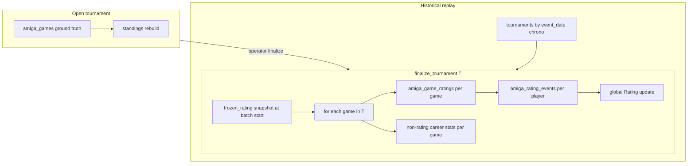

# Amiga tournament finalize & rating events — implementation contract

**Status:** **Implemented** (Jun 2026) — tournament finalize commit boundary live in Python + PHP; rating history from `amiga_rating_events`  
**Scope:** `ko2amiga_db` rating commit model, derived replay, and related read-path policy  
**Supersedes:** [`amiga-data-contract.md`](amiga-data-contract.md) § Post-game / replay for rating and global career-stat commit rules  
**Implementation plan:** [`amiga-tournament-finalize-implementation-plan.md`](amiga-tournament-finalize-implementation-plan.md) — slices 0–7 complete  

**Related:** [`amiga-data-contract.md`](amiga-data-contract.md) · [`amiga-chronology-fix-plan.md`](amiga-chronology-fix-plan.md) · [`amiga-tournament-format-vision.md`](amiga-tournament-format-vision.md) · [`scripts/amiga/README.md`](../scripts/amiga/README.md)

---

## 1. Purpose

This document is the **implementation contract** for a fundamental change to how the Amiga realm commits **derived** ladder state.

**Today:** each canonical game immediately updates global `amiga_player_stats`, `amiga_game_ratings`, and related derived tables via per-game replay / `process_completed_game`.

**Target:** global career stats and **authoritative rating** commit only at **tournament finalize**. Per-game rating **facts** are still persisted on each game during finalize, but they are **game-derived data**, not writes to the player’s global rating.

This model supports:

- Live tournaments with result entry, corrections, and withdrawal before ladder impact
- Historical resimulation under **frozen within-event Elo** (fair, order-independent inside a tournament)
- Honest **rating history** (no fake per-game ladder steps inside an event with unknown real play order)
- Game pages that show “this match caused +14” from stored per-game adjustments

---

## 2. Why we are changing

### 2.1 Problems with per-game global commit

| Problem | Example |
|---------|---------|
| Corrections cascade | Wrong result entered → global games count and rating already moved → painful replay |
| Open tournament drift | Player at 100 global games; 3 played in ongoing event → global shows 103 before event is official |
| Within-event Elo order | Sequential global rating between rounds of the same event depends on synthetic game order |
| Rating history dishonesty | Chart steps inside one tournament day imply a timeline we do not have |

### 2.2 Design goal

> **Nothing in global derived state changes until a tournament is finalized.**  
> Finalize runs one batch for that tournament: process all games, persist per-game derived rows, then commit player-level rating and career aggregates.

---

## 3. Glossary (key concepts)

| Term | Definition |
|------|------------|
| **Ground truth** | `amiga_games`, `tournaments`, players, fixtures — facts entered or imported; never invented by replay |
| **Commit boundary** | `finalize_tournament(T)` — the only operation that writes global career derived state for tournament `T` |
| **Finalize batch** | Single transactional pass over all games in tournament `T` in contract order |
| **Frozen rating** | `global.Rating` for a player at **batch start**; used as Elo input for every game in that batch; does not change until batch end |
| **Entry rating** | Same value as frozen rating at batch start — not a separate lifecycle concept; guaranteed because global rating is not mutated during the batch |
| **Per-game adjustment** | `adjustment_a` / `adjustment_b` on a game’s derived row — how much **this game** moved that player’s tournament delta, computed from frozen ratings |
| **Tournament rating delta** | `SUM(per-game adjustments)` for a player over all games in tournament `T` |
| **Rating event** | One row per `(tournament_id, player_id)` at finalize: `rating_before`, `rating_delta`, `rating_after` — a point on the **authoritative rating timeline** |
| **Game-derived rating data** | Per-game row (`amiga_game_ratings`): inputs, expected scores, adjustments — attached to the **game**, not the player’s global rating |
| **Open tournament** | Lifecycle `running` (or equivalent): ground truth and standings may update; **no** global derived commit |
| **Rating authority** | `amiga_player_stats.Rating` + `amiga_rating_events` — not per-game `new_rating_*` as global ladder position |

---

## 4. Architecture overview

### 4.1 Data flow (target)

```
OPEN TOURNAMENT (live)
  enter / correct results  →  amiga_games (ground)
                           →  amiga_tournament_standings (rebuild from games)
                           →  global amiga_player_stats UNCHANGED
                           →  amiga_game_ratings UNCHANGED
                           →  amiga_rating_events UNCHANGED

FINALIZE TOURNAMENT(T)
  1. snapshot frozen_rating[P] = global.Rating(P) for all players in T’s games
  2. for each game in T (game_date ASC, id ASC):
       - compute Elo from frozen_rating (both sides)
       - INSERT/REPLACE amiga_game_ratings (incl. adjustment_a/b)
       - apply non-rating career stats per game (W/D/L, goals, DD, networks, …)
       - do NOT mutate global.Rating during this loop
  3. for each player P who played in T:
       - rating_delta = SUM(adjustments for P in T’s games)  [from stored game rows or running sum]
       - rating_after = frozen_rating[P] + rating_delta
       - INSERT amiga_rating_events row
       - global.Rating(P) = rating_after
       - update rating peak/nadir from rating events (not from intra-batch steps)
  4. mark tournament rating_finalized

HISTORICAL REPLAY
  clear derived (or full rebuild)
  for each tournament T in ORDER BY event_date ASC, chrono ASC:
      if T has at least one game:
          finalize_tournament(T)
```

### 4.2 What is NOT the commit path

- Per-game `process_completed_game` that updates global `amiga_player_stats` on each result ( **retired** for tournament games )
- Using `amiga_game_ratings.new_rating_*` as global ladder position after each game
- Updating `PeakRating` / `LowestRating` after each game inside a finalize batch
- Rating history charts built from per-game `new_rating_*` steps within a tournament

---

## 5. Tournament finalize — detailed algorithm

### 5.1 Preconditions

- Tournament `T` exists and has a committed game set (may be empty → skip finalize).
- For **live** finalize: operator action; lifecycle should be `running` → `completed` (or explicit finalize on `completed`).
- For **historical** replay: all imported tournaments with games are auto-finalized in catalog order.
- **At most one tournament finalize** may run at a time (DB flag or ops lock). Finalize is expected to take seconds to minutes.

### 5.2 Idempotency

- Tournament has `rating_finalized_at` (nullable datetime) and/or `rating_finalized` boolean.
- Re-running finalize on an already-finalized tournament without **reopen** is an error (or explicit `refinalize` mode).
- `clear_derived` / full replay clears `amiga_game_ratings`, `amiga_player_stats`, `amiga_rating_events`, and resets finalize markers on tournaments.

### 5.3 Step 0 — Load games

```sql
SELECT g.*
FROM amiga_games g
WHERE g.tournament_id = :tournament_id
ORDER BY g.game_date ASC, g.id ASC
```

Contract order matches [`amiga-data-contract.md`](amiga-data-contract.md) § Chronology.

### 5.4 Step 1 — Frozen rating snapshot

At batch start, for every `player_id` appearing in any game in `T`:

```text
frozen_rating[player_id] = amiga_player_stats.Rating[player_id]  -- default 1600 if new player
```

**Invariant:** `frozen_rating[P]` equals global rating at batch start because global rating is not modified until step 3.

This is the **entry rating** for event `T` for player `P`. No separate early lock is required for the commit algorithm.

### 5.5 Step 2 — Per-game processing (inside batch)

For each game `G` with players `A`, `B`:

#### 5.5.1 Elo (frozen inputs)

```text
rating_a_input = frozen_rating[A]
rating_b_input = frozen_rating[B]
expected_a, expected_b = elo_expected(rating_a_input, rating_b_input)
adjustment_a = K * (actual_score - expected_a)
adjustment_b = -adjustment_a
```

- **K = 32**, start **1600** — unchanged from current sandbox constants.
- **Do not** use `frozen_rating + cumulative_delta` as input — that reintroduces within-event order dependence.

#### 5.5.2 Persist game-derived rating row

Write to `amiga_game_ratings` (1:1 with `game_id`):

| Column | Semantics (new contract) |
|--------|--------------------------|
| `rating_a`, `rating_b` | Frozen inputs used for this game |
| `expected_score_a/b` | From frozen inputs |
| `adjustment_a/b` | **This game’s** contribution to tournament delta |
| `actual_score`, outcome flags, goals | As today |
| `new_rating_a/b` | **Deprecated for authority** — see § 7.1 |

**Critical:** this INSERT updates **game** derived data only. It does **not** change `amiga_player_stats.Rating`.

#### 5.5.3 Non-rating career stats

Apply existing per-game logic (`apply_match` / PHP equivalent) for:

- `NumberGames`, W/D/L, goals, ratios
- DD / CS counts and networks
- Opponent networks (victim/culprit)
- `AverageOpponentRating` — opponent strength for this game must use **`frozen_rating[opponent]`**, not post-batch global rating
- Personal goal/margin extremes (`BiggestWin`, etc.) — still per-game during batch using contract order for tie-breaks (`>` not `>=`)

**Rating field in `PlayerState`:** must **not** be updated per game during the batch (`commit_rating=false` or equivalent). Global rating commit happens only in step 3.

**Explicitly excluded from per-game batch updates:**

- `PeakRating`, `LowestRating` — updated from **rating events** after step 3
- `CurrentRatingAscent` / `Descent` — revisit in implementation; authoritative ascent/descent should align with **rating events**, not intra-tournament game steps

### 5.6 Step 3 — Player-level rating commit (batch end)

For each player `P` who played at least one game in `T`:

```text
rating_before = frozen_rating[P]
rating_delta  = SUM(adjustment for P over all games in T)   -- from amiga_game_ratings
rating_after  = rating_before + rating_delta

INSERT amiga_rating_events (tournament_id, player_id, rating_before, rating_delta, rating_after, games_in_event, …)
UPDATE amiga_player_stats SET Rating = rating_after WHERE player_id = P
```

Players in `T` with zero games: no rating event (or skip).

### 5.7 Step 4 — Rating peak / nadir

**Rating** peak and nadir (`PeakRating`, `LowestRating`, related `*GameID` pointers) are computed from the **chrono sequence of rating events** plus bootstrap (1600), **not** from per-game steps inside a tournament.

Rationale: synthetic within-tournament game order is not a fair timeline for rating extremes.

Goal-based peaks (biggest win, most goals, etc.) remain per-game during the batch — separate concern.

### 5.8 Step 5 — Finalize marker

```text
UPDATE tournaments
SET rating_finalized_at = NOW(), rating_finalized = 1
WHERE id = T
```

Align with existing `lifecycle_status = completed` / `completed_at` where appropriate.

### 5.9 Verification identities (must hold after replay)

For each player `P` and consecutive rating events `E1`, `E2` in tournament chronological order:

```text
E2.rating_before = E1.rating_after
```

For each tournament `T` and player `P`:

```text
SUM(adjustments for P in T) = rating_event(P,T).rating_delta
rating_event(P,T).rating_after = rating_event(P,T).rating_before + rating_delta
```

Global rating equals latest `rating_after` for players with at least one rating event (modulo bootstrap).

---

## 6. Live operations

### 6.1 While tournament is open

| Action | Allowed writes |
|--------|----------------|
| Enter / edit / void a result | `amiga_games`, fixture status, provenance |
| Rebuild standings | `amiga_tournament_standings`, catalog stats |
| Display league table | From standings — no global ladder movement |

| Forbidden until finalize |
|---------------------------|
| `amiga_player_stats` (all columns) |
| `amiga_game_ratings` |
| `amiga_rating_events` |
| Global rating on leaderboard / profile |

### 6.2 Finalize (operator)

- Trigger: ops UI / CLI `finalize-tournament --tournament-id=N`
- Runs § 5 in one transaction (or chunked with rollback)
- **Safeguard:** only one tournament finalize at a time globally
- After success: leaderboard and profiles reflect new global stats; game pages show per-game adjustments from `amiga_game_ratings`

### 6.3 Corrections

**Before finalize:** edit ground truth only; recompute standings; no derived global repair.

**After finalize:** requires **reopen + refinalize** (later slice — document behaviour now):

1. Reverse tournament `T`’s contribution to global state (or rebuild derived from scratch from `T` forward)
2. Delete `T`’s `amiga_game_ratings` rows and `amiga_rating_events` for `T`
3. Clear `T.rating_finalized_at`
4. Re-run `finalize_tournament(T)` and **all later tournaments** in catalog order (global rating chain)

---

## 7. Schema changes

### 7.1 `amiga_game_ratings` (existing — semantics change)

Keep table; **change meaning**:

- `rating_a/b` = frozen batch-start inputs (not “global rating before this game in ladder history”)
- `adjustment_a/b` = per-game delta from this match (stored for consumers)
- `new_rating_a/b` = **non-authoritative** — options:
  - **Slice 1:** leave NULL or stop writing
  - **Later:** optional `frozen + cumulative_delta_within_event` for UI only; never used for ladder or peaks

### 7.2 `amiga_rating_events` (new)

Proposed DDL (exact types may adjust in migration):

```sql
CREATE TABLE amiga_rating_events (
  id              INT AUTO_INCREMENT PRIMARY KEY,
  tournament_id   INT NOT NULL,
  player_id       INT NOT NULL,
  rating_before   DECIMAL(10,6) NOT NULL,
  rating_delta    DECIMAL(10,6) NOT NULL,
  rating_after    DECIMAL(10,6) NOT NULL,
  games_in_event  SMALLINT NOT NULL DEFAULT 0,
  finalized_at    DATETIME NOT NULL,
  UNIQUE KEY uq_rating_event_tournament_player (tournament_id, player_id),
  KEY idx_rating_events_player_chrono (player_id, finalized_at),
  FOREIGN KEY (tournament_id) REFERENCES tournaments(id) ON DELETE CASCADE,
  FOREIGN KEY (player_id) REFERENCES amiga_players(id) ON DELETE CASCADE
);
```

**Rating event** = one ladder step attributable to completing a tournament.

Future: `event_type` column if non-tournament rating events are added (e.g. orphan games).

### 7.3 `tournaments` (extend)

```sql
ALTER TABLE tournaments
  ADD COLUMN rating_finalized TINYINT(1) NOT NULL DEFAULT 0,
  ADD COLUMN rating_finalized_at DATETIME NULL;
```

Historical import backfill: set `rating_finalized = 0` until replay runs; after full replay, all tournaments with games should be `rating_finalized = 1`.

Optional ops lock table or `SELECT … FOR UPDATE` on a singleton row for “one finalize at a time”.

### 7.4 `tournament_entrants` (optional slice 2)

`entry_rating` / `pending_rating_delta` on entrants are **not required** for the core commit algorithm (frozen map at batch start is sufficient). May be added later for:

- Provisional UI before finalize
- Audit display (“locked at 1842 when event opened”)

Do not block slice 1 on entrant rating columns.

---

## 8. Historical replay

### 8.1 Tournament processing order

```text
ORDER BY tournaments.event_date ASC, tournaments.chrono ASC
```

This matches import game-block order: same-day tournaments are sequential blocks, not interleaved rounds ([`amiga-chronology-fix-plan.md`](amiga-chronology-fix-plan.md)).

**Do not** use `tournament.id` alone as replay order.

### 8.2 Replay entrypoint (target)

Replace game-at-a-time global commit in `scripts/amiga/replay.py` with:

```text
clear_derived()
for T in tournaments_chrono_order:
    if exists games for T:
        finalize_tournament(T)
rebuild_all_standings()   -- if not already inside finalize
rebuild_all_catalog_stats()
```

PHP ops simul must call the same finalize primitive for parity.

### 8.3 Parity with legacy

- **Old sequential global Elo replay will not match** — intentional.
- Legacy Access `Rankings` grid remains **reference only** ([`amiga-data-contract.md`](amiga-data-contract.md) § Reference truth).
- New oracle: this contract + verification identities in § 5.9.

### 8.4 Edge cases

| Case | Rule |
|------|------|
| Tournament with zero games | Skip finalize |
| `amiga_games.tournament_id IS NULL` | **Zero-tolerance:** import must assign every game a `tournament_id`; `verify-rating-events` (slice 3) fails if any rated game has NULL. Orphan rows are import bugs, not replay edge cases. |
| Player’s first career game | `frozen_rating = 1600` |
| Player in multiple tournaments | Each event produces one rating event; chain via `rating_before` / `rating_after` |
| Withdrawn entrant, no games | No rating event |

---

## 9. Read path (website & API)

### 9.1 Authoritative sources

| Consumer need | Source |
|---------------|--------|
| Current ladder rating | `amiga_player_stats.Rating` |
| Rating history chart | `amiga_rating_events` ordered by tournament `event_date`, `chrono` (or `finalized_at`) |
| Rating peak / nadir | Recompute or maintain from `amiga_rating_events` sequence |
| Game page: adjustment | `amiga_game_ratings.adjustment_a/b` |
| Game page: “rated at” | `amiga_game_ratings.rating_a/b` (frozen for that event) |
| Tournament standings (open or closed) | `amiga_tournament_standings` from games |

### 9.2 Changes from today

- `api/player_rating_history.php?realm=amiga` should read **rating events**, not per-game `new_rating_*` walks
- Profile chart: one step per tournament (per player), not per game within event
- Leaderboard during open tournament: unchanged global ratings until finalize

### 9.3 Match streaks

Unchanged product policy: **do not surface** match streaks on Amiga ([`amiga-data-contract.md`](amiga-data-contract.md) § Match streaks). Replay may still write streak columns for schema parity; not used for rating.

---

## 10. Ops module changes

### 10.1 Retire / replace

| Current | Target |
|---------|--------|
| `amiga_process_completed_game()` updates global on each game | **Tournament games:** no global commit until finalize |
| `run_process_game.php process-one` append-only per game | **Live:** result entry writes ground truth + standings only; separate `finalize-tournament` |
| `replay-to` walks games globally | **Simul:** `replay-to-tournament` or full tournament-order replay |

### 10.2 New primitives

| Primitive | Responsibility |
|-----------|----------------|
| `finalize_tournament(T)` | § 5 entire batch — canonical in Python and PHP |
| `clear_derived()` | Extended to clear `amiga_rating_events`, reset `rating_finalized` flags |
| `verify-rating-events` | § 5.9 identities |
| `refinalize_tournament(T)` | Post-close correction path (later slice) |

Shared Elo: continue `scripts/ladder/elo.py` / `post_game_elo.php` for formula; wrap with frozen-rating batch driver.

---

## 11. Implementation slices

### Slice 1 — Core contract (minimum viable) — done (impl plan slices 0–2)

- [x] DDL: `amiga_rating_events`, `tournaments.rating_finalized(_at)`
- [x] Python `finalize_tournament(T)` with frozen ratings, per-game `amiga_game_ratings`, batch-end rating commit
- [x] Python replay: tournament-order finalize loop replaces game-at-a-time global rating
- [x] Non-rating career stats per game inside batch (rating field frozen)
- [x] Rating peak/nadir from rating events only
- [x] `clear_derived` / `verify-rating-events` CLI for § 5.9 identities
- [x] Update [`amiga-data-contract.md`](amiga-data-contract.md) post-game section to point here

### Slice 2 — PHP ops parity — done

- [x] `finalize_tournament` in PHP ops (same semantics as Python)
- [x] Live result entry: ground + standings only (no global derived)
- [x] `finalize-tournament` ops endpoint + one-at-a-time lock
- [x] Hard-fail `process-one` for tournament-tagged games; `replay-to` removed (use Python replay)

### Slice 3 — Read path — done

- [x] Rating history API from `amiga_rating_events`
- [x] Profile chart update (one point per rating event)
- [x] Game page: show `adjustment_*` and frozen `rating_*` from `amiga_game_ratings`

### Slice 6 — Corrections & refinalize

- [x] `reopen-tournament --tournament-id=T` (Python + PHP CLI)
- [x] `refinalize-from --tournament-id=T` rebuild-forward through later tournaments
- [x] Fixtures ops guardrails when `rating_finalized`
- [x] Smoke: `python scripts/amiga/refinalize_smoke.py`

### Slice 5 — Optional enhancements

- [ ] `new_rating_*` as cumulative-within-event display column
- [ ] `tournament_entrants.entry_rating` for provisional pre-finalize UI
- [ ] Full chrono export of all rating events

---

## 12. Non-goals (this rework)

- Changing K-factor, starting rating, or Elo formula
- Cross-realm player linking with online `ko2unity*`
- Match streak product surfaces
- Parity with legacy Access `Rankings` monthly grid as authority
- Per-game global rating commit for tournament games

---

## 13. Summary diagram



---

## 14. Agreement record

This contract reflects alignment (Jun 2026) on:

1. **Commit boundary** = tournament finalize only for global derived state  
2. **Frozen rating** at batch start = entry rating for all Elo inputs in the event  
3. **Per-game adjustments** persisted on `amiga_game_ratings` — game-derived, not player-global  
4. **Rating events** = authoritative rating timeline for charts and rating peak/nadir  
5. **Historical replay** = finalize every tournament in catalog chronology order  
6. **No global derived writes** during an open tournament  

---

**Verification (oracle):**

```powershell
python -m scripts.amiga replay
python -m scripts.amiga verify-chronology
python -m scripts.amiga verify-rating-events
python -m scripts.amiga refinalize-smoke
php site/public_html/amiga/ops/run_process_game.php finalize-tournament --tournament-id=N
```

*Handoff: [`docs/orchestration/agent-handoffs/2026-06-08-027-rating-events-slice-7-ship.md`](orchestration/agent-handoffs/2026-06-08-027-rating-events-slice-7-ship.md)*
