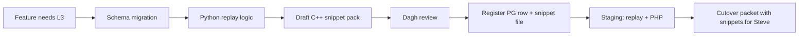

# Post-game C++ handoff (Steve — option 2)

**Agreed May 2026:** Steve prefers **code snippets to insert** into his post-game C++ — written by us, based on `docs/ratings_cpp.txt` — not vague specs alone and not a full replacement file unless he asks later.

**Implication for features:** When a feature needs **L3** live writes, plan the **C++ snippet pack** during design (same time as schema + replay), not only at cutover.

---

## What we deliver per register item (PG-…)

| Piece | Where |
|-------|--------|
| Register row | [post-game-register.md](post-game-register.md) |
| Snippet pack | `docs/coordination/cpp-snippets/PG-NNN-short-name.md` |
| Python parity (if replay) | `scripts/ladder/` + [replay-register.md](replay-register.md) |
| Cutover section | [cutover-packet-template.md](cutover-packet-template.md) §3 — link snippet file |

Steve **merges** snippets into his tree; we do **not** commit his full server binary to this repo.

---

## Snippet pack format (copy `cpp-snippets/_template.md`)

Each pack should include:

1. **Summary** — one sentence behaviour change.
2. **Anchor** — function / step in `docs/ratings_cpp.txt` (e.g. after `INSERT ratedresults`, inside player A `UPDATE` block).
3. **Insert instruction** — “Add after line that does X” / “Replace block Y” (Steve-readable).
4. **C++ snippet(s)** — complete enough to paste; match his style (types, `con`, table/column names from schema docs).
5. **Data contract** — columns read/written; NULL defaults; draw `WinnerID = -1` etc.
6. **Replay mirror** — “Same logic in `scripts/ladder/…`” or “N/A — live only”.
7. **Smoke check** — one example game → expected DB fields (optional but useful).

**Quality bar (Dagh review before send):** compiles in context Steve expects; no invented column names; consistent with sandbox replay if both exist.

---

## Workflow (feature → prod)

- **Staging** still has **no live games** — C++ cannot be validated on staging DB; trust replay + review, then prod post-game deploy.
- **History:** replay (or Steve replay to same spec) **before** relying on new per-game fields for old rows.

---

## What we do *not* do (unless Steve changes mind)

| Option (asked May 2026) | Status |
|-------------------------|--------|
| Precise prose only; Steve implements from scratch | Not preferred |
| **Snippets to insert (option 2)** | **Agreed** |
| One single long core-function replacement | Not preferred |
| Agents edit server files directly; deploy tested binary | Not agreed |

---

## Related

- Reference excerpt: `docs/ratings_cpp.txt`
- Registers: [post-game-register.md](post-game-register.md)
- Hub: [prod-coordination.md](../prod-coordination.md)
