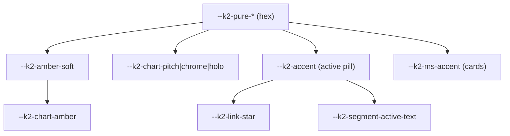

# Kick Off 2 Ratings � Design Direction

**Status:** current design contract, May 2026. Phase A hub shell and Status Phase B v1.2 are shipped in repo; staging deploy is via WinSCP, not `git push`.

**Authority:** `PROJECT_BRIEF.md` owns product taste. This doc owns visual identity, theme tokens, chrome, and cosmetics-track guidance. Dagh's latest chat instruction wins on scope.

**Related:** `PROJECT_MEMORY.md` for current focus, `docs/hub-ia-agreement.md` for hub IA, `docs/STATUS_PAGE_DATA.md` for Status panels, `docs/tint-vs-realm.md` for tint vs realm.

---

## Current Contract

The ratings site should feel like a live, premium stats surface for a competitive retro community: dark, precise, vibrant, and alive. It should not clone kickoff2.com's museum/pixel-pitch look.

Use **neon noir statistics** as the shorthand:

- Deep charcoal/navy backgrounds, not flat black.
- Data leads; chrome supports it.
- Electric accents are sparing: links, active tabs, chart series, avatar rings, small highlights.
- Tables, numbers, and charts stay readable before they are decorative.
- No pixel fonts for body/table/chart text.
- No glow on everything.

**Branding:** shell copy is realm-neutral: **Kick Off 2 ratings** as the product idea, with the header wordmark currently **Kick Off 2**. "KOOL" remains community vocabulary, not the primary visual identity.

---

## Realm vs Tint

**Realm** chooses the ladder universe and data: `online` now, `amiga` later.

**Tint** chooses UI paint: `amber`, `pitch`, `chrome`, `holo`. Without a manual pill pick, tint follows a **six-hour rotation** in the visitor�s local time (holo → pitch → chrome → amber); see [`tint-vs-realm.md`](tint-vs-realm.md). A manual pill choice applies for the **current six-hour window only**, then the schedule resumes. Tint is stored on `html[data-k2-accent]` and must not imply realm.

```html
<html data-realm="online" data-k2-accent="amber">
```

Rules:

- Charts stay realm-neutral and use the chart palette.
- Links, nav rings, avatar ring, and small UI accents derive from `--k2-accent`.
- Hub segment track uses outline active cell styling (site tint, not realm colour).
- Amiga/offline can later add photos/media without forking the design system.

---

## Color System

**Source of truth:** `site/public_html/stylesheets/theme.css` (`:root` + `html[data-k2-accent="�"]`). Chart.js reads the same variables via `js/chart-theme.js` (`K2ChartTheme.pitch()`, `.amber()`, `.pureAmber()`, etc.).

**Tint vs chart:** The four hub tint pills share **hex** with `--k2-pure-*`, but **roles differ**. Tint (`--k2-accent`) follows the picker. Chart amber is **softened** and **does not** follow the picker. Milestone card glow always uses **pure** tier hues. See also [`docs/tint-vs-realm.md`](tint-vs-realm.md).

### Layers (pointer chain)

Only **`--k2-pure-*`** (and chart-only `teal` / `magenta`) hold literal hex. Everything else is `var(...)` or `color-mix(...)`.

```text
--k2-pure-amber | pitch | chrome | holo     ? only hex for these four
        �
        +-? --k2-amber-soft (85% pure-amber + 15% text-primary)
        �         +-? --k2-chart-amber --? T.amber()  (goals, play-texture, �)
        �
        +-? --k2-chart-pitch|chrome|holo --? var(--k2-pure-*) --? T.pitch() etc.
        �
        +-? --k2-ms-accent on garden card --? var(--k2-pure-*)  (per tier token)
        �
        +-? --k2-accent (active tint pill) --? var(--k2-pure-*)
                  �
                  +-? --k2-link-star (85% accent + 15% primary)  ? links, player names
                  +-? --k2-segment-active-text (72% accent + 28% secondary) ? hub/LB nav active tab
                  +-? pure fill: avatar initial, LB filter dot when on, calendar selected day
```



### Foundational hues (`--k2-pure-*`)

| Token | Hex |
|-------|-----|
| `--k2-pure-amber` | `#ffb74d` |
| `--k2-pure-pitch` | `#9ccc65` |
| `--k2-pure-chrome` | `#64b5f6` |
| `--k2-pure-holo` | `#b388ff` |
| `--k2-ms-holo` | `#bf80f8` | Milestone **legendary** band only; site tint/charts use `--k2-pure-holo` |

Chart-only (no tint pill, no `--k2-pure-*` twin): `--k2-chart-teal` `#4db6ac`, `--k2-chart-magenta` `#ff4081`.

### Derived mixes

| Token | Recipe | Follows tint picker? |
|-------|--------|----------------------|
| `--k2-amber-soft` | 85% `--k2-pure-amber` + 15% `--k2-text-primary` | **No** (always goals-orange family) |
| `--k2-link-star` | 85% `--k2-accent` + 15% `--k2-text-primary` | **Yes** |
| `--k2-link-star-hover` | 94% accent + 15% primary | **Yes** |
| `--k2-link` | 72% accent + 28% `--k2-text-secondary` | **Yes** |
| `--k2-segment-active-text` | 72% accent + 28% secondary | **Yes** |
| `--k2-segment-active-ring` | 55% accent + transparent | **Yes** |

**When tint is Amber:** `--k2-accent` = `--k2-pure-amber`, so **link-star and amber-soft are the same colour** (same 85/15 recipe and same base). They **diverge** when tint is Pitch, Chrome, or Holo (links follow tint; amber charts stay amber-soft).

### When to use which token

| Surface | Token / class | Why |
|---------|----------------|-----|
| Milestone garden unlocked title, border, glow | `--k2-ms-accent` ? `--k2-pure-*` | Full saturation; must not use `--k2-chart-amber` (soft) |
| Hero / ranked10 tier label (pitch/chrome/amber/holo) | `--k2-pure-*`; legendary ? `--k2-ms-holo` on `.k2-lb-ms-tier--holo` | Tier identity, not chart ink |
| Amber chart series (play-texture amber, �) | `T.amber()` ? `--k2-chart-amber` ? `--k2-amber-soft` | Bars need soft mix on dark UI; not tint-following |
| Pitch / chrome / holo chart series | `T.pitch()` etc. ? `--k2-chart-*` ? `--k2-pure-*` | Full palette ink (no extra softening yet) |
| H2H pair charts (cumulative wins, rating compare) | `T.h2hSubject*` ? chrome; `T.h2hOpponent*` ? `--k2-table-negative` | Matches poster rivalry band; **not** pitch/chrome profile compare; opponent red is table ink, not `T.magenta()` |
| H2H goals-per-game histogram | Single: `T.chrome()` / `T.tableNegative()`; grouped adds both | Shared x-axis 0..max of either player’s peak GF; Profile single series also `T.chrome()` |
| Player name, profile link, Elo highlight span | `a.k2-link-star` / `.k2-link-star` | Tint-following soft accent |
| Active hub tab, LB wing tab, player sub-nav | `--k2-segment-active-text` | Softer than link-star (72% + secondary) |
| Active tint pill **label** | same 72/28 as segment (via swatch in mix) | Matches nav |
| Active tint pill **dot** | `--k2-accent-swatch` = pure | Colour chip shows true hue |
| Include inactive / provisional filter **on** dot | `--k2-accent` (pure) | Small control; full accent + glow |
| Avatar ring, calendar day fill | `--k2-accent` (pure) | Structure, not prose |
| Win / league meta / ticker counts | `.blue` / `.holo` | **Stat palette**, not `--k2-pure-*` or tint |
| Body copy, career stat value | `--k2-text-primary` | Neutral |

### Chart role aliases (`--k2-chart-*`)

| Alias | Points to |
|-------|-----------|
| `--k2-chart-pitch` | `var(--k2-pure-pitch)` |
| `--k2-chart-chrome` | `var(--k2-pure-chrome)` |
| `--k2-chart-holo` | `var(--k2-pure-holo)` |
| `--k2-chart-amber` | `var(--k2-amber-soft)` |

### Do not

- Point milestone cards or tier glow at `--k2-chart-*` (chart amber is softened).
- Use `T.linkStar()` for amber **chart** series if the chart must stay goals-orange when tint is Chrome (use `T.amber()`).
- Duplicate hex for the four hub hues outside `:root` / `html[data-k2-accent]` swatch lines.
- Assume �chart amber� and �tint amber� are one variable; they are related hues with different tokens and mixes.

### Text/link hierarchy (unchanged classes)

| Layer | Rule |
|-------|------|
| Body/table data | `--k2-text-primary`, normal weight |
| Muted helpers/headings | `--k2-text-muted` |
| Hub page lede (`.k2-hub-page-intro` in `.k2-hub-page-intro-head`) | 13px `--k2-text-muted`, max-width 44rem � Milestones catalog + HoF footnotes above tables; optional `.blue` / `.holo` |
| Hub section chapter (`.k2-hub-chapter`) | `__title` 1.25rem/600 **primary** (intentional — sole “where you are” landmark; not accent/glow; Jun 2026 trial reverted); `__lede` 13px muted; optional `__list` (compact disc bullets, muted+accent `::marker`, same typography) via `$k2HubChapterList` in `includes/k2_hub_chapter.inc.php`. Online hub: Activity, Leaderboards (`lb_nav.php`), Milestones, HoF (rules list). Amiga hub: News (`/amiga/news.php`), Leaderboards (`amiga_lb_nav.php`), Tournaments, Live tournaments, Activity (`/amiga/activity.php`), HoF. |
| Status-style tickers (arc line) | `--k2-text-muted`; key counts `.blue` |
| Onboarding / long explanatory prose (Play & setup) | `--k2-text-secondary` (14px); page title stays `--k2-text-primary` |
| Player names / dense table links | `a.k2-link-star`, weight 600; hover/focus underline |
| Prose/footer links | `--k2-link` |
| Positive/negative table stats | `.blue` / `.red` on profile/games rows, Status ticker/meta, record **date markers** (`(New!)` / `(Legendary)` on `hall-of-fame.php`); **not** on calm leaderboard value cells |
| HoF record row label + date column | `server-records-table` col 1 + 4 ? `--k2-text-muted`; value (anchor) + holder unchanged; online two-panel HoF: shared col 1 via `--k2-hof-label-col-ch` (`includes/records_hof_table.php` + label register in `hall-of-fame.php`) |
| Hub `ranked-pages-table`, Activity peaks, Status `k2-status-table` calm body cells | default `--k2-text-secondary`; anchor ? link-star or league-anchor-ink; `k2-table-col-sorted` ? primary 600 |
| Player games (`player/games.php`, `k2-table--player-games`) | Calm secondary body; **keep** `.blue`/`.red` on Result/Diff/Adjustment; active sort column ? primary 600 (PHP `k2-table-col-sorted`); sorted editorial cells ? weight 700 on `.blue`/`.red` (trial) |
| Player matchup W/D/L (`individual2a`, `k2-table--player-matchup`) | Calm-stats; **Games** anchor; `.blue`/`.red` editorial; bolder when sort column (700) |
| Player Goals + DDs matchup (`individual2b/c`) | Hub LB parity (`ranked2` / `ranked3`); calm-stats, no editorial blue/red; **Games** anchor; `lb_column_help` headers/tooltips |
| Leaderboard / Status **anchor** column (one per table) | `data-k2-anchor-col` + `k2-table-anchor-cell` ? `--k2-link-star`, weight 600; permanent. **Online hub leaderboards:** **Elo** (col 2, centered header; tooltip title **Elo rating**) on every wing; default sort stays each wing's hero stat. Status active board: league-anchor-cross on Pts/Games only. |
| Status **league** anchors (Pts / Games) | `k2-table--league-anchor-cross` ? `--k2-league-anchor-ink` (85% pure + primary, same recipe as link-star): **chrome** when tint is amber or pitch; **pitch** when tint is chrome or holo � not `--k2-accent`. |
| Calm LB active sort (not anchor) | `k2-table--calm-stats` + `k2-table-col-sorted` ? `--k2-text-primary`, weight 600 (tunable; avoids faux link-star) |
| **Calm-stats default body** (Jun 2026) | All `k2-table--calm-stats` body cells ? `--k2-text-secondary` unless anchor or sorted; ranked leaderboards also use `ranked-pages-table ranked-table-pending` + `$k2RankedCloak`; anchor/sort classes server-rendered via `k2_table_helpers.php` on first paint |
| Other sortable tables (non-calm) | `k2-table-col-sorted` ? `--k2-segment-active-text`, weight 600 |
| **Listbox / archive picker** (`.k2-archive-listbox`) | Closed: `--k2-text-secondary`, weight 500; hover/open/selected: subtle `color-mix` toward primary (not full primary); selection via background � **not** `--k2-segment-active-text`; trigger width locked to longest option label (JS measure probe); Leagues picker row uses max width across day/week/month/year so tab change does not shift step nav; **Player Games** Result/Opponent/Goals scored/Goals conceded filters use the same component (`includes/k2_archive_listbox.php`) |
| **Flatpickr (Leagues day)** | Day cells + month chrome: `--k2-text-secondary`; weekdays/disabled: muted; selected day: accent fill |
| **Leagues meta ticker** | Plain **League** + `<span class="blue">` period label; end dates use full month names (`F j` UTC) |

Do not add one-off hex in page CSS when a token exists.

---

## Typography

| Use | Typeface / rule |
|-----|-----------------|
| Body, tables, chart labels | IBM Plex Sans (self-hosted `fonts/`, `k2-fonts.css`) |
| Numbers | tabular numbers or IBM Plex Mono where useful |
| Display chrome | Exo 2 for wordmark, hero name/stat values, avatar initial (self-hosted; preloaded in `k2_fonts_head.php`) |
| Panel/chart headings | `.k2-panel-heading`: small, muted, weight 600 |
| Hub section chapter title | `.k2-hub-chapter__title`: 1.25rem (~20px), weight 600, **primary** — editorial “you are here” landmark above wing tabs; accent/glow reserved for wordmark, league/H2H destinations, semantic data; pairs with muted `__lede`. **Amiga time travel:** snapshot hub tabs **omit** chapter block when `as=` active — temporal stamp + ribbon replace it ([`amiga-time-travel-policy.md`](amiga-time-travel-policy.md) §5.0). |
| Amiga time-travel LED stamp | **DSEG7 Classic** (`fonts/dseg7-classic-regular.woff2`) — **display-only** on `.k2-amiga-tt-stamp__segment`; never for body/table/chart text. Mono kicker uses IBM Plex Mono. Policy + intent: [`amiga-time-travel-policy.md`](amiga-time-travel-policy.md) §5.0. |
| Text selection (drag highlight) | `::selection` on `body.k2-site` � `--k2-text-selection-bg` (tint mix), primary ink; replaces OS/browser default blue |

Never use pixel/bitmap fonts for readable data.

---

## Chrome And Layout

Current shared chrome:

- `includes/site_header.php` for wordmark + **realm switcher** (`includes/realm_switcher.php`: Online � Amiga 500, beside wordmark) + cross-realm player search (`realm=all`, per-hit Online/Amiga label). Realm switch uses segment-outline active cell (site tint, not per-realm colours). Wordmark **always** street-sign neon (`text-shadow` layers on `.k2-wordmark__main`, px-capped and pleasant rather than foggy � avoid huge `calc()` blurs); **hover** adds a controlled wider shadow (no unbounded bloom).
- `includes/hub_nav.php` for Status / Activity / Leaderboards / Milestones / **Games** / Hall of Fame / Play & Setup (`games/recent.php` hub default; Recent · Highlights · All games sub-nav).
- `includes/lb_nav.php` for leaderboard wing tabs.
- `includes/player_nav.php` for player context tabs.
- `includes/k2_head.php` for shared CSS and early theme boot (`k2-fonts.css` before `theme.css`; no Google Fonts).

Navigation pattern:

- Hub, player, and leaderboard wings use **segment track + outline active cell**.
- **Inner sub-nav** (compact segment below a wing ribbon): **12px** gap from wing (`--k2-wing-to-subnav-gap`) and **12px** to table/panel (`--k2-subnav-to-content-gap`) — `theme.css` `:has(+ …)` rules; league honours, activity, player Opponents/Milestones, Amiga WC LB + hub player/stats tabs.
- Hub and player nav no longer support A/B style overrides; the preview/tuning scaffolding has been pruned.
- Tint picker: compact right-anchored **Tint** disclosure pill (current swatch dot when closed); four swatch choices open to its left; closed by default; segment-outline active choice; inactive swatches dimmed (`k2_tint_picker.php`, `k2-tint-toggle.js`).
- Secondary actions can use quiet rounded pills when they act like controls rather than content links (e.g. Player Games `Reset` / pager actions); Status Leagues keeps period tabs separate from its spacious prev/picker/next stepper.

Imagery:

- No repeating site-wide decorative banner.
- Use imagery where it earns its place, e.g. Status heritage box or future Amiga photos.
- **Amiga player hero:** country as fourth hero stat (label + flag under Rank/Rating/Games); `k2_amiga_country_flag.php` + `img/flags/amiga/`.
- **Amiga leaderboards (player rows):** Country column after Elo (col 3) — centered flag via `k2_lb_th_country()` / `k2_lb_td_country_open()` on Rating, Calendar-geo, Tournament honours, Goals, DDs, Victims, Peak, Performance.
- **World Cups tournament stats (wing 2):** Host Country column after Year — centered flag from `host_country` via `k2_amiga_country_table_cell_or_dash()` on Goals, DDs, Participation, Geography, Podium tables.
- Status heritage box may use a clipped tint-following halo behind the art; the inset boundary contains the light.
- Dense tables and charts should start high on the page.
- **In-page scrollbars** (`.k2-table-wrap`, archive listbox panels, heatmaps, bracket rails, etc.): thin muted thumb via `--k2-scrollbar-*` tokens in `theme.css` — not OS default gray, not tint accent. Page-level vertical scroll stays native unless we extend tokens to `html` later.
- **Amiga time travel chrome (when `as=` active):** header **Present day | Time travel** (**T19** fixed homes: Present → News; Time travel → rating LB + `as=`) → **temporal stamp** (LED date + kicker) → **snapshot ribbon** (Year · Month · Event) → hub/player content. Present mode: no stamp/ribbon; hub chapters stay. Intent + locked rules: [`amiga-time-travel-policy.md`](amiga-time-travel-policy.md) §5.0.

**Surface rhythm (mixed containment):** Not every data block needs the same bordered panel. Use **open page background** when the visual is the content (profile heatmaps: played days/weeks on `--k2-bg-hover` cells). Use **chart panels** (`k2-chart-panel`, `k2-chart-frame`) when Chart.js, toggles, and fixed frames need a reading device � Activity and profile charts share this. Use **light tiles/mosaics** for small stat or story clusters. Alternating open and contained blocks creates scroll rhythm; uniform panel stacks feel generic. Profile contract: [`player-profile-feast.md`](player-profile-feast.md) � Surface rhythm. Do not panel everything for �consistency� unless the module type warrants it.

---

## Current Page Contracts

| Area | Current truth |
|------|---------------|
| Status hub | `status.php` is the default landing; Phase B v1.2 room grid is shipped in repo. |
| Leaderboards | `leaderboards/*.php` (legacy doc ids `ranked1`–`ranked10`) use `k2-table.js` for simple sort/autorank. See [`k2-table-implementation-checklist.md`](k2-table-implementation-checklist.md). |
| Games | `games/recent.php` renders 14 sortable day buckets using shared rated-game rows. |
| Player profile | `player/profile.php` is the shipped feast layout; **mixed surface rhythm** (open heatmaps + chart panels + light tiles) � see [`player-profile-feast.md`](player-profile-feast.md); gradual copy/UX improvements only. |
| Player games | `player/games.php` uses server-side Result/Opponent/Goals scored/Goals conceded filters, URL sort links, 100-row slices, and shared row rendering. |
| Records/Hall of Fame | `hall-of-fame.php` is the Hall of Fame page; `leaderboards/activity-peaks.php` is Activity. |
| Activity / charts | `activity.php` hub chapter lede (direct, question-led prose) then summary block: key activity sentence, fact cards (goals, draws, double digits, clean sheets, **busiest day**), a small games/opponents line, and charts grouped into question-led sections with short intros; established-player chart group (new per year, cumulative, rating distribution); **no** Recent milestones digest panel (removed Jun 2026); **no** participation-depth or Double Digit Merchant chart stacks; `milestone.php` uses generic per-milestone unlock year/cumulative charts only; dense monthly bar charts use borderless bars to reduce phone noise; helper copy should add context, not restate the chart heading. Chart.js hovers use `--k2-tooltip-*` tokens (same as `.k2-table-tooltip`) via `chart-theme.js` (`mergeTooltip` / `applyTooltipDefaults`); dataset colour swatches use the tooltip surface + solid stroke. **Implementation plan:** [`activity-charts.md`](activity-charts.md) � single module, lab-only `.k2-chart-frame`, lab ? promote (no global phone layout changes during lab). |

Microcopy:

- Tooltips are supplemental: use them for abbreviations, formulas, unfamiliar rules, and hidden context.
- Do not add tooltip text that only repeats a visible label; sortable headers can rely on the shared `Click to sort.` affordance when no extra explanation is useful.
- Leaderboard hub wings (`ranked1`�`5`, `7`, `10`, league honours, ranked8 longevity): shared strings in `site/public_html/includes/lb_column_help.php`. Column help uses **you** = the player in that row (not the site visitor); see `docs/k2-table-and-games-plan.md`.
- Avoid native `title` attributes for visible-label help; use visible labels, `aria-label`, or the shared K2 tooltip behavior as appropriate.

---

## CSS And Tooling

Default path:

- No build step.
- Plain CSS custom properties and component classes in `stylesheets/theme.css`.
- Shared head include via `includes/k2_head.php`.
- Chart colors through `js/chart-theme.js`.

Tailwind:

- Not the site-wide strategy today.
- Theme-lab Tailwind/CDN experiments are retired.
- Do not introduce a build pipeline without explicit approval and deploy notes.

Legacy cleanup:

- `main2.css` is removed.
- Visible table styling belongs to `theme.css`.
- `elolist.css` is removed; ranked cloak and table compatibility styling live in `theme.css`. `elolist.js` is no longer used by the migrated leaderboard/player-games paths.

---

## Open Decisions

- Exact `<title>` rename timing from old KOOL wording to Kick Off 2 ratings.
- Further profile copy/UX and fun stats block.

---

## Agent Notes

- Read this before CSS/theme/chrome work.
- Keep cosmetics slices small and reversible.
- Add shared assets through existing includes; do not duplicate `<link>` blocks.
- Preserve dense table functionality while changing visuals.
- Update this doc only when a visual contract changes, not for every tiny CSS tweak.

*Last pruned: May 2026 � current contract separated from retired theme-lab history.*
