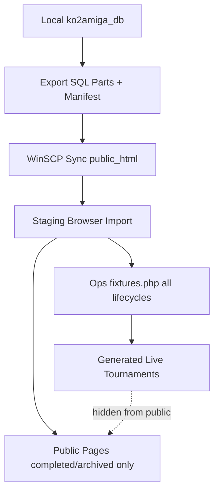

# Amiga tournament architecture/product checkpoint

**Date:** 2026-06-07  
**Status:** Active guidance after worker jobs 001–011

## Where we are

The internal tournament backbone is in good shape for future formats:

| Layer | Status |
|-------|--------|
| Entrants (`tournament_entrants`) | Ground truth; verify green |
| Lifecycle (`lifecycle_status`) | Ground truth; verify green |
| Stages & fixtures | Ground truth for generated events |
| KOA player naming | Internal CLI (`players check-name|suggest-name|create`) |
| Entrant onboarding | Internal CLI (`add-entrant`, `onboard-newcomer`) |
| Stage placement | Guarded CLI (`add-stage-player` / `place-entrant`) |
| Result entry & attach-game | Guarded; lifecycle + entrant checks |
| Browser ops | Password-gated `/amiga/ops/fixtures.php` (create, lifecycle, results) |
| Public historical UI | `/amiga/tournaments.php`, `/amiga/tournament.php` (derived standings) |
| Staging export package | Manifest refreshed to 23 parts (job 007); full sync/import pending |

Worker jobs 001–011 closed foundation and internal-ops guardrails. The remaining risk is **product boundary and deployment confidence**, not core schema design.

## Demo-readiness goals

Two steps matter before showing the system to interested people:

1. **Staging works end-to-end** — export → WinSCP sync → preview/import → spot-check public pages and ops.
2. **Public UI is safe** — internal draft/running/smoke tournaments must not appear in the public catalog.

## Architecture snapshot



## Strategic decisions (this checkpoint)

### 1. Pause deep model slices

Do not delegate another foundation/guardrail worker job until staging refresh and public visibility are proven. Swiss, honours, and public builder stay deferred.

### 2. Next job sequence

| Order | Job | Owner | Why |
|-------|-----|-------|-----|
| **A** | Public visibility boundary | Implemented in this checkpoint | Prevents smoke data leaking to public index even before staging refresh |
| **B** | Staging export re-run | Agent (local export) | Refreshes SQL parts after jobs 008–011 |
| **C** | Staging sync + import | **Dagh** (WinSCP + browser) | Cannot be automated from repo; required for demo confidence |
| **D** | Read-only live public view | Future worker | After visibility + staging proven |
| **E** | Browser entrant onboarding | Future worker | Reduce CLI stitching for internal operators |
| **F** | Public builder / registration | Deferred | After internal workflow is smooth |

### 3. Public visibility rule (conservative)

Public tournament pages show only `lifecycle_status IN ('completed', 'archived')`.

- Imported Access history → `completed` (import default).
- Internal generated smokes in `draft` / `ready` / `running` → ops only.
- `void` tournaments → never public.

Internal ops (`/amiga/ops/fixtures.php`, CLI) unchanged.

A future explicit `public_visibility` or publish flag may be added later for curated live events; not in this checkpoint.

### 4. Swiss and format expansion

The explicit format/stage/fixture/entrant model is **ready for extension**. Swiss needs pairing policy, bye handling, and standings scope rules — design checkpoint after demo path is stable.

## What “show interested people” means now

**Ready today (after visibility + staging):**

- Browse ~600 historical tournaments, standings, groups, knockout brackets.
- Explain the fixture-backed architecture and internal ops path conceptually.

**Not ready for external operators yet:**

- Public tournament creation or registration.
- Public live score entry.
- Full group+knockout automation or Swiss.

## Verification baseline

Before next demo-oriented work, expect:

```powershell
python -m scripts.amiga fixtures verify
python -m scripts.amiga fixtures verify-entrants
python -m scripts.amiga fixtures verify-lifecycle
python -m scripts.amiga verify-tournament-formats
powershell -ExecutionPolicy Bypass -File scripts\export_ko2amiga_db.ps1
```

Staging: preview URL must show `parts: 23` per [`docs/amiga-staging-handoff.md`](../amiga-staging-handoff.md).

## Staging export (checkpoint run)

**2026-06-07 21:49:03** — local export re-run after jobs 008–011 and public visibility implementation:

```powershell
powershell -ExecutionPolicy Bypass -File scripts\export_ko2amiga_db.ps1
# Wrote 23 part files + manifest; max amiga_games.id=27422
```

Integrity checks passed (`fixtures verify`, `verify-entrants`, `verify-lifecycle`, `verify-tournament-formats`).

**Pending (Dagh):** WinSCP sync `site/public_html/` including all `ko2amiga_*.sql` parts, then staging preview/apply per [`prompt-012-staging-sync-rehearsal.md`](prompt-012-staging-sync-rehearsal.md).

## Related docs

- Orchestration model: [`amiga-tournament-orchestration-model.md`](amiga-tournament-orchestration-model.md)
- Data contract: [`../amiga-data-contract.md`](../amiga-data-contract.md)
- Staging loop: [`../amiga-staging-handoff.md`](../amiga-staging-handoff.md)
- Next worker prompt (staging sync): [`prompt-012-staging-sync-rehearsal.md`](prompt-012-staging-sync-rehearsal.md)
