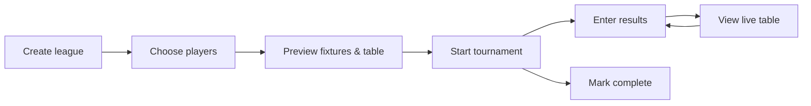

# Browser organizer workflow checkpoint

**Date:** 2026-06-08  
**Status:** Active guidance after worker jobs 001–017  
**Classification:** internal ops / UX architecture / product workflow

## Executive summary

The password-gated fixture manager at `/amiga/ops/fixtures.php` is technically capable: it can create kitchen-marathon leagues, manage entrants, assign fixture slots, transition lifecycle, record results, and show derived standings. For a normal organizer running a league night, it still reads like a database console. The next phase should reshape the same guarded operations into a clear **create → choose players → preview → start → enter results → view table** path, league-first, without schema changes or late-entrant edge-case work.

---

## 1. Diagnosis — current workflow problems

| Problem | What the operator sees today | Why it hurts |
|---------|------------------------------|--------------|
| **Technical console framing** | Page title “Fixture manager”; copy mentions lifecycle, stages, CLI guardrails | Signals maintainer tooling, not tournament running |
| **Create form dominates** | “Create kitchen marathon” is always the first major section, even when viewing tournament #638 | After creation the operator remains at the top of a long page; the new tournament is easy to miss |
| **Raw player IDs at create** | Comma-separated `player_ids` text field | Requires knowing internal ids; contradicts the entrant search UX added in job 014 |
| **No workflow sections** | One vertical stack: lifecycle → entrants → stage players → fixtures → standings → tournament list | No obvious “what do I do next?”; setup and results interleaved |
| **Lifecycle exposed raw** | `draft` / `ready` / `running` badges; “Transition to” dropdown; “result entry requires running lifecycle” | Correct guardrails, wrong vocabulary; feels like state-machine debugging |
| **Stage internals on the happy path** | “Stage players” section with `stage_key`, `stage_type`, place-entrant form | Kitchen marathon auto-places everyone in `overall`; this section is late-entrant/edge-case noise for normal leagues |
| **Fixture table is ops-heavy** | Columns for fixture id, `fixture_key`, stage type; assignment forms inline with results | Hard to scan as a match list; result entry competes visually with assignment |
| **Standings only after games** | “No derived standings yet. Enter a fixture result…” | Operator cannot preview an empty league table before kickoff |
| **Navigation by tournament id** | Manual numeric id + “View” at top; recent list at bottom | Extra step; list link says “view fixtures” not “open tournament” |
| **POST reload confusion** | POST actions re-render the full page; create form does not repopulate on error; no `view` anchor after POST | Validation errors lose form input; flash appears at top while relevant section may be far below |
| **Jargon in labels** | “Legs”, “kitchen marathon”, `fixtures place-entrant`, fixture `#145` | Internal model leaking into primary UI |

**What works and should be preserved:** password gate, generated-tournament guardrails, entrant search/add/withdraw/replace, stage-scoped assignment selects, result entry with derived processing, overall standings query, recent-tournament list, CLI parity for edge cases.

---

## 2. Proposed organizer happy path (league)

Friendly sequence for a typical kitchen-marathon league night:



| Step | Organizer language | Success looks like |
|------|-------------------|-------------------|
| 1 | **Create league** | Name, date, country saved; format = round-robin league (kitchen marathon template) |
| 2 | **Choose players** | Pick existing players by name search; at least two; seeds assigned automatically |
| 3 | **Preview** | Fixture list grouped by round; league table shows all players at 0 pts |
| 4 | **Start tournament** | One clear action when setup looks right; results unlock |
| 5 | **Enter result** | Pick match → goals → save; table updates |
| 6 | **View table** | Standings always visible during `running` |
| 7 | **Finish** | “Mark complete” when all fixtures played (or explicit complete when allowed) |

**Implicit rules (unchanged under the hood):** result entry only when `lifecycle_status = running`; generated tournaments only; imported history remains read-only in this UI.

---

## 3. Page / view structure proposal

Keep a **single PHP page** (`fixtures.php`) with a `view` query parameter (or path segment later). Default when `tournament_id` is set: **`fixtures`** (preview). When no tournament selected: **`setup`** (create + pick recent).

| View | Tab label | Primary content | Secondary / collapsed |
|------|-----------|-----------------|------------------------|
| `setup` | **Setup** | Create league form; friendly status (“Not started” / “Ready to start” / “In progress” / “Finished”); start / complete actions | Raw lifecycle timestamps; `registration` transition if ever needed |
| `players` | **Players** | Entrant list; search + add; withdraw / replace | Seed/note fields optional; link to CLI for onboard-newcomer |
| `fixtures` | **Fixtures** | Read-only match list grouped by round; leg label “Home & away” when applicable | Fixture keys hidden; assignment UI only if slots empty (rare for kitchen create) |
| `table` | **Table** | League standings — **empty rows from entrants** before any results | Position sort; same columns as today |
| `results` | **Results** | Scheduled matches with both players assigned; goal entry only | `extra` field de-emphasized or in “more” |
| `advanced` | **Advanced** *(collapsed)* | Stage players placement; fixture id column; lifecycle debug; fixture status filter | Late-entrant workflow; CLI parity hints |

**Chrome changes:**

- Page title: **Tournament organizer** (subtitle: internal ops, password-gated).
- Tournament header: name + date + friendly status badge (map from `lifecycle_status`).
- Tab bar sticky below header when `tournament_id > 0`.
- Recent tournaments list: always reachable from Setup; link text **Open** not “view fixtures”.

**Imported tournaments:** read-only tabs for Fixtures + Table; no Setup/Players/Results mutations; muted banner “Historical import — ops changes via CLI”.

---

## 4. Friendly actions → technical model

| Organizer action | User-facing control | Existing backend (reuse) |
|------------------|---------------------|---------------------------|
| Create league | Setup form: name, date, country, round-robin type | `POST action=create_kitchen` → `amiga_fixture_create_kitchen_tournament()` |
| Choose format | “League (round-robin)” only in slice 1; cup/group later | `format_template_id` = `kitchen_marathon`; `has_league=1` |
| Choose players | Multi-select from `amiga_fixture_search_players()` | Parsed to player id list → entrants + `tournament_stage_players` + fixture players (already done in create) |
| Rounds / legs | “Single round-robin” / “Home and away (double round-robin)” | `legs` 1 or 2 → `round_robin_fixture_plan` |
| Preview fixtures | Fixtures tab read query | Existing fixture SQL; group by `round_no` from `fixture_key` or `phase_label` |
| Preview table | Table tab: entrants as zeroed rows when no `amiga_tournament_standings` | New **read-only presentation** only — query entrants + left join standings |
| Mark ready | Optional intermediate; can auto on create for leagues | `set_lifecycle_status` → `ready` (if we keep two-step start) |
| Start tournament | Primary button on Setup | `set_lifecycle_status` → `running` (from `ready`; auto-ready if still `draft` and fixtures exist) |
| Enter result | Results tab | `POST action=record_result` → `amiga_fixture_record_result` + `amiga_process_completed_game` |
| View table | Table tab | Existing `amiga_tournament_standings` query for `scope_type=league` (primary scope) |
| Mark complete | Setup when no scheduled fixtures remain | `set_lifecycle_status` → `completed` |
| Add late player | Advanced → Players (unchanged behavior) | `add_entrant` → `place_stage_entrant` → `assign_players` |
| Withdraw / replace | Players tab | Existing entrant POST actions |

No new tables required for the happy path. Optional small PHP helper: `amiga_fixture_empty_league_table_rows($con, $tournamentId)` merging entrants with standings for display.

---

## 5. League-first design details

### Player selection

- **At create:** searchable checklist or “add to tournament” chips, reusing `amiga_fixture_search_players()`. Minimum two players; duplicate refused. Seeds assigned in selection order (same as today).
- **After create:** Players tab uses existing entrant list + search; hide raw id in primary column (show name; id in muted tooltip or Advanced only).

### Rounds / legs

- Replace numeric “Legs” with:
  - **Single round-robin** — each pair plays once (`legs=1`).
  - **Home and away** — each pair plays twice (`legs=2`).
- Show computed match count hint: “N players → M fixtures” using `expected_round_robin_fixtures()` logic (PHP can mirror the small formula).

### Empty league table

- As soon as tournament has registered entrants, Table tab lists every entrant with Pos `—`, Pts `0`, Games `0`, etc.
- After first result, merge in derived `amiga_tournament_standings` rows (existing query wins for stats).

### Fixtures before results

- Fixtures tab is **read-first**: round headings, “Player A vs Player B”, status scheduled/played.
- Kitchen marathon create already assigns all players to fixtures; assignment forms move to Advanced or hidden unless a slot is empty.

### Start gate

- **Start tournament** enabled when: generated league, ≥2 active entrants, all scheduled fixtures have both players, lifecycle is `draft` or `ready`.
- Implementation option A (simplest): one button calls ready then running in sequence if needed. Option B: auto-`ready` on create for kitchen marathon only. **Recommend A** in first slice to avoid changing create semantics.

---

## 6. Hide, demote, or rename

| Current UI | Decision |
|------------|----------|
| “Create kitchen marathon” | Rename **Create league**; show only on Setup when no tournament open, or Setup tab when id set |
| Comma-separated player ids | **Remove** from primary create; replace with search/multi-select |
| “Legs” | Rename per §5 |
| Lifecycle block (status, started, completed, transition dropdown) | **Demote** to Setup; friendly labels: Not started (`draft`), Ready (`ready`), In progress (`running`), Finished (`completed`); single **Start tournament** / **Mark complete** buttons instead of raw dropdown |
| `registration` lifecycle | **Hide** unless explicitly needed; kitchen create stays `draft` |
| Stage players section | **Move to Advanced** for league; keep out of happy path |
| Fixture id, fixture_key columns | **Hide** on Fixtures tab; keep in Advanced |
| Stage type / stage_key in fixture rows | **Hide** on Fixtures tab (single-stage league) |
| Inline assign forms on kitchen leagues | **Hide** when both players already set (default after create) |
| Fixture status filter (scheduled/played/void) | **Demote** to Advanced |
| Tournament id input | Keep compact in header; **auto-fill** after create redirect |
| Player `#id` suffixes | Muted or Advanced-only in Tables/Fixtures/Results |
| CLI command names in copy | Remove from primary tabs; one Advanced footnote |

---

## 7. Navigation and state behavior

| Behavior | Specification |
|----------|---------------|
| **After create** | POST-redirect-GET to `?once=…&pwd=…&tournament_id={new}&view=fixtures` with success flash |
| **After POST mutations** | PRG to same `tournament_id` + `view` appropriate to action: entrant ops → `players`; result → `results` or `table`; lifecycle → `setup`; assign → `fixtures` |
| **Flash messages** | Prefer PHP session flash (`$_SESSION['amiga_ops_flash']`) or signed query param; render once at top of active tab panel |
| **Form repopulation** | On create validation error, repopulate name, date, country, legs, selected player ids without redirect |
| **Scroll / anchor** | `view` param removes need for fragile `#` scrolling on long page |
| **Deep links** | Hub `/amiga/live-tournaments.php` should link to organizer with `tournament_id` (future slice; document now) |
| **Password + once** | Preserve on all redirects via hidden fields or session after first auth |

---

## 8. Non-goals and deferrals

| Topic | Status |
|-------|--------|
| Late-entrant fixture generation / rescheduling | Deferred — Advanced path only; no new automation |
| Swiss pairing | Deferred |
| Honours / World Cup class | Deferred |
| Public registration | Deferred |
| Public tournament builder | Deferred |
| Group+knockout browser create | Deferred (CLI `create-group-knockout` remains) |
| Browser onboard-newcomer / player create | Deferred — CLI `players create` / `fixtures onboard-newcomer` |
| Schema migration | Not required for this workflow |
| Staging export/import refresh | Dagh-assisted; not part of worker slices |
| Splitting into multiple PHP routes | Deferred; tabs on one page first |

---

## 9. Phased implementation plan

| Phase | Slice | Deliverable | Review focus |
|-------|-------|-------------|--------------|
| **A** | **019** | Organizer shell: tabs, rename, PRG redirect after create, friendly create labels, player multi-select at create, form repopulation on error | Can an operator create a league and land on Fixtures without scrolling? |
| **B** | 020 | Friendly lifecycle on Setup: Start / Complete buttons, status badges, hide raw transition dropdown | Can an operator start and finish without learning lifecycle enum? |
| **C** | 021 | Fixtures + Table presentation: round grouping, empty league table from entrants, hide fixture ids on main tabs | Can an operator preview before kickoff? |
| **D** | 022 | Results tab: dedicated result entry list; demote assignment to Advanced | Can an operator enter scores without scanning a wide ops table? |
| **E** | 023 | Advanced panel: stage players, withdraw/replace, status filter, debug ids | Late-entrant path still reachable |
| **F** | 024 | Hub integration: `live-tournaments.php` links to organizer views; optional session password | End-to-end from hub |

Each slice touches primarily `site/public_html/amiga/ops/fixtures.php` and `site/public_html/stylesheets/amiga-tournament.css` (tab layout). Document updates in `docs/amiga-data-contract.md` / `scripts/amiga/README.md` only when behavior boundaries change.

---

## 10. Recommended `prompt-019` — first implementation slice

**Title:** Browser organizer shell — tabs, create redirect, player picker

**Goal:** Turn the fixture manager into a navigable organizer workspace for league create, without yet restructuring fixtures/table/results presentation.

### In scope

1. **Rename chrome** — page title and H1: “Tournament organizer”; intro copy describes the happy path.
2. **`view` query param** — values: `setup`, `players`, `fixtures`, `table`, `results`, `advanced`. Valid only when `tournament_id > 0`; default `fixtures` when id set, else `setup`.
3. **Tab navigation** — horizontal nav rendering only the active panel; preserve `once`, `pwd`, `tournament_id` on tab links.
4. **Move create form** — render only on `setup` (no tournament) or Setup tab (tournament open). Remove from top of every tournament view.
5. **Create form UX**
   - Rename to **Create league**.
   - Legs select labels: “Single round-robin” / “Home and away”.
   - Replace `player_ids` text input with player search + “Add player” building a selected list (hidden inputs or comma field populated by JS-free repeated add via GET/POST — prefer server-side list from posted `player_ids[]` array).
   - Show match-count hint from player count + legs.
6. **POST-redirect-GET after successful `create_kitchen`** — redirect to new `tournament_id` + `view=fixtures` + flash.
7. **PRG for other POST actions** — redirect back with same `tournament_id`, `view` mapped by action (minimum: create, `add_entrant`, `record_result`, `set_lifecycle_status`); use session flash.
8. **Form repopulation on create error** — keep user on setup view with entered values and selected players.
9. **Relocate existing sections** into tab panels without rewriting inner HTML yet (entrants → players; lifecycle → setup; fixture table → fixtures; standings → table; result forms stay in fixtures until slice 022).
10. **PHP lint** + existing `fixtures verify*` commands.

### Out of scope for 019

- Empty league table from entrants (021)
- Friendly Start/Complete buttons replacing lifecycle dropdown (020)
- Hiding stage players / fixture ids (021–023)
- CSS redesign beyond minimal tab bar
- New endpoints or schema

### Suggested acceptance checks

```powershell
# Create league via browser with player search picks → lands on Fixtures tab for new id
# Create validation error → name/date/players preserved
# Tab links keep tournament context
# python -m scripts.amiga fixtures verify
# php -l site/public_html/amiga/ops/fixtures.php
```

### Optional helper (document only if implemented in 019)

- `amiga_fixture_ops_flash_set(string $message, bool $isError): void` + read-once at render.
- `amiga_fixture_ops_redirect(int $tournamentId, string $view, ?string $flash, bool $isError): void` — centralizes PRG.

---

## References

- Ops page: `site/public_html/amiga/ops/fixtures.php`
- Builder: `scripts/amiga/tournament_builder.py` (`create_kitchen_marathon_tournament`)
- Fixtures CLI: `scripts/amiga/tournament_fixtures.py`
- Data contract: `docs/amiga-data-contract.md`
- Prior browser ops: handoffs 014–017 in `docs/orchestration/agent-handoffs/`
- Architecture checkpoint: `docs/orchestration/amiga-tournament-architecture-checkpoint.md`
