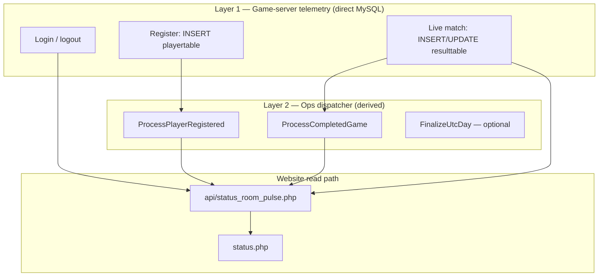

# Live environment simulation — policy & spec

**Status:** Locked direction (Jul 2026). **Simulate prod-shaped live activity** on **local work only** so the website (especially Status live pulse) can be developed and signed off **without waiting for tonight's play**.

**Doc set (read together before implementation or testing):**

| Doc | Role |
|-----|------|
| **This file** | Live sim platform — L1–L3 behaviours, guard, dispatcher boundary, harness, checklist |
| [`status-room-live-policy.md`](status-room-live-policy.md) | Status pulse product contract (SRL-1…SRL-17); **`live_fp` excludes half-countdown** — client ticks clock locally |
| [`status-room-live-implementation-plan.md`](status-room-live-implementation-plan.md) | Pulse shipped file map + verification workflow |
| [`STATUS_PAGE_DATA.md`](STATUS_PAGE_DATA.md) | Status panels, data sources, snapshot vs live |

**This is a platform idea**, not a one-off test hack. We should have had this years ago instead of "refresh prod and see what happens."

**Primary consumer today:** Status room live polling ([`status-room-live-policy.md`](status-room-live-policy.md)). Same ground writes exercise profile search, milestones, leaderboards, and any feature that reacts to "someone just joined / logged in / finished a game."

**Not ops simul.** This doc is **not** [`work-db-prepare.md`](work-db-prepare.md) / `run_ops_sim.php`. Ops simul replays **history** into derived tables. Live sim fakes **continuous game-server telemetry** that prod has in real time but imports lack.

**For agents:** read this before extending the live sim harness, lobby scripts, or pulse smoke tests.

**Harness (work only):** `http://work.ratingskickoff.test/status-room-live-sim.php`

---

## Quick start (testing Status live)

1. Laragon + MySQL running; **`ko2unity_work`** prepared ([`work-db-prepare.md`](work-db-prepare.md)).
2. Open **`http://work.ratingskickoff.test/status-room-live-sim.php`** → **Start 20-game sequence**.
3. Open **`http://work.ratingskickoff.test/status.php`** in another tab (or same window).
4. DevTools → Network → confirm **`status_room_pulse.php`** every ~1 s; watch Online, Live games, cascades.
5. **Stop** when done — lobby clears (everyone offline, no live games); finished rated games remain.

**Pass criteria:** § Test checklist (SIM-T1…T12). **Next implementation:** § Roadmap (SIM-R3 FinalizeUtcDay, SIM-R5 probe).

---

## Product vision

| Problem | Live sim answer |
|---------|-----------------|
| Status live pulse needs moving lobby data | Generate logins, registrations, live games on demand |
| Staging/work imports are snapshot-stale | Same MySQL tables prod uses — we write ground truth locally |
| Waiting for prod play slows UI iteration | One button → minutes of realistic activity |
| Cascade / glow / league ripple hard to rehearse | Finish rated games through **real post-game ops** on work |

**Success looks like:** Dagh opens work Status, clicks **Start** on the sim page, and watches the room behave like a busy evening — online list churn, a new name in New players, live scores ticking, cascades when games finish — **without** a real game server and **without** prod.

---

## Three live behaviours (scope)

Everything we simulate falls into one of three prod-shaped lanes:

| # | Behaviour | Prod writer | Ground tables | Status pulse signals |
|---|-----------|-------------|---------------|----------------------|
| **L1** | **Login / logout** | Game server (continuous) | `playertable.IsOnline`, `LastLogin` | `online_fp`, `last_login_epoch` |
| **L2** | **Registration** | Game server (event) | new `playertable` row (`JoinDate`, name, …) | `last_join_epoch`, New players panel |
| **L3** | **Playing games** | Game server (continuous + event) | live `resulttable` → finish → `ratedresults` | `live_fp`, `last_rated_id` cascade |

Optional later: **L4 midnight UTC** via `FinalizeUtcDay` (league close, day milestones) — not required for Status v1.

### L1 — Login / logout (shipped)

- **One lobby event per tick** — at most one of: register, login, logout, or match kickoff login (host/slave step).
- **No batch bootstrap** on Start; online ramps one login at a time toward **3–8** target.
- **Login** (`mark_player_online` only): `IsOnline = 1` + `LastLogin = NOW()`.
- **Logout:** `IsOnline = 0` only; `LastLogin` unchanged.
- **No logout** for players in pending/live match or post-game grace window.

### L2 — Registration (shipped)

- **`Sim_XXXX`** insert: `JoinDate = NOW()`, `LastLogin = 1970-01-01`, `IsOnline = 0` → `ProcessPlayerRegistered`.
- Shows in **New players** only until a separate login event; **never** Recent logins on register alone.
- Added to lobby pool; may log in later via L1 or match kickoff.

### L3 — Playing games (shipped)

- **Up to four live matches** concurrently; lobby targets **3–8 online** via staggered logins.
- **Kickoff sequence:** host login → wait 2–6 s → slave login → wait 3–8 s → live row at 0–0 (each login is its own tick/event).
- **Goals:** 3–8 total per match; first goal ~5–12 s; then every 5–15 s (one per tick max).
- **Finish:** last goal → `ratedresults` + ops; players get **8–25 s grace** before random logout.
- **Crash:** **per-game** % at kickoff (default **5**), not per-second — scheduled disconnect mid-match.
- Queue ~20 matches by default.

### Tick order (~1 s)

Each tick: **one** pending step (if due) → tick all live → maybe start one pending → **one** lobby event (register/login/logout).

| Priority | Action |
|----------|--------|
| 1 | Advance **one** due pending kickoff step (login_host / login_slave / kickoff) |
| 2 | Tick every live match (clock, goals, finish, scheduled crash) |
| 3 | Start **one** new pending match if under cap |
| 4 | **One** L2 register **or** L1 login/logout (skipped if step 1 already logged someone in) |

### Online & match rules (locked)

| Rule | Detail |
|------|--------|
| **Kickoff** | Live row only if **both** host and slave `IsOnline` at kickoff; else match **re-queued** at front (`kickoff_aborted:not_online`). |
| **During live** | Both must stay online; otherwise live row deleted (`player_offline`), no rated insert. |
| **Lobby logout** | Never targets host/slave in **pending or live** match (`match_player_ids`). |
| **Lobby idle** | L1 login/logout runs even during live games (one event/tick); never logout match players or grace window. |
| **Crash** | **Per-game %** at kickoff (default **5**); if scheduled, disconnect once between 30 s and 4 min into the match — **not** per-tick %. |
| **Completed count** | Increments **only** on rated finish — not on cancel/crash/Stop. |

### Timing (seconds, inclusive random ranges)

| Event | Range |
|-------|--------|
| After Start, before first kickoff | 0 (bootstrap logins immediate) |
| Host login → slave login | 1–3 |
| Slave login → kickoff | 2–5 |
| First goal after kickoff | 5–12 |
| Between goals | 5–15 |
| After rated finish → next kickoff | 2–6 |
| Post-finish player grace (no random logout) | 8–25 |
| After cancel / crash | 10–25 |
| After kickoff abort / failed insert | 8–20 |

### Stop (locked)

Halt ticks · **logout all online** · **delete in-progress sim live rows** (`GameID >= 990000`, unfinished) · clear queue + pending. **Finished** `ratedresults` + derived ops from the run **remain**.

### Status pulse integration (testing)

When exercising sim on **`work.ratingskickoff.test/status.php`**:

- Goals change `live_fp` (scores) → score pulse; **half clock keeps ticking** (no list HTML replace on score-only — see [`status-room-live-policy.md`](status-room-live-policy.md)).
- Rated finish → `last_rated_id` cascade → Recent games updates **immediately** on last goal (no artificial delay).
- Cancel/crash/Stop → live row vanishes; no cascade unless a rated row was already written.

---

## Architecture — two layers (dispatcher boundary)

Prod live is **not** one pipe through `dispatch.php`. The game server writes MySQL **directly** for high-frequency telemetry; dispatch handles **discrete derived events** after ground commits.



### Should live sim go through the dispatcher?

| Sim action | Through `dispatch.php`? | Why |
|------------|-------------------------|-----|
| Login / logout | **No** | Prod game server never dispatches these — it UPDATEs `playertable` directly. Sim must mirror that. |
| Live match ticks (score, clock) | **No** | Continuous `resulttable` UPDATEs — game-server ground, not ops. |
| **Registration** (after INSERT) | **Yes** — `ProcessPlayerRegistered` | Same as [`post-dagh-live-story.md`](../site/public_html/ops/docs/post-dagh-live-story.md): ground row first, then dispatch. |
| **Rated game finish** (after INSERT) | **Yes** — `ProcessCompletedGame` | Ground `ratedresults` (seven columns, `NewRatingA` NULL) → dispatch. |
| Midnight league / day milestones | **Optional** — `FinalizeUtcDay` | Separate cron-shaped event; add when testing day rollover. |

**Implementation note (work harness):** calling `k2_ops_process_completed_game()` / `k2_ops_process_player_registered()` **directly** is equivalent to `php ops/dispatch.php CMD=…` — dispatch is a **router**, not different business logic. Prefer the **same module entry points** dispatch uses; CLI dispatch is optional for manual replay.

**Do not** route telemetry through dispatch — that would invent a prod shape we do not have and would not test the real pulse SQL paths.

Reference: [`ops-dispatch.md`](../site/public_html/ops/docs/ops-dispatch.md) · [`ladder-ops-platform.md`](ladder-ops-platform.md) §2.

---

## End-to-end flow (target)

```text
[Sim tick ~1 s — Status pulse and/or sim control page poll]

  idle (no live, no pending):
    ~18% → one login OR one logout (lobby pool only; never match players)

  next match (queue non-empty, gap elapsed):
    login_host → wait 3–8s → login_slave → wait 4–12s → kickoff (both online?)
      → live 0–0 OR re-queue if not online

  live match:
    ~2% crash → logout one player, cancel live
    else clock −50/tick, goal every 10–40s (one per tick max)
    last goal → ratedresults + ProcessCompletedGame → Recent games cascade
    wait 10–30s → next match

  Stop → all offline, cancel live, clear queue (rated finishes kept)
```

**Browser:** `work.ratingskickoff.test/status.php` polls `status_room_pulse.php` (~1 s).

**Full DB reset:** refresh work from baseline ([`work-db-prepare.md`](work-db-prepare.md) §3.1) — not what **Stop** does.

---

## Where to run (locked)

| ID | Decision |
|----|----------|
| SIM-1 | **Database:** **`ko2unity_work`** for local live sim. |
| SIM-2 | **URL:** **`http://work.ratingskickoff.test/`** — hostname selects work DB ([`LOCAL_DEV.md`](LOCAL_DEV.md)). |
| SIM-3 | **Do not** use **`ko2unity_db`** — frozen for ladder narrative; no new rated history. |
| SIM-4 | **Do not** mutate **`ko2unity_baseline`**. |
| SIM-5 | **Staging / prod** — harness **disabled** after sync (`k2_status_room_sim_is_allowed()` requires **`ko2unity_work` + `work.ratingskickoff.test`**). No accidental pollution of `kooldb1` or prod. |
| SIM-6 | **Prod** — real truth only; **no sim UI** on prod `status.php`. |

### Runtime guard (locked)

`k2_status_room_sim_is_allowed()` in `includes/status_room_live_sim.php` — **both** must pass:

| Check | Value |
|-------|--------|
| `$database` | exactly **`ko2unity_work`** |
| `HTTP_HOST` | exactly **`work.ratingskickoff.test`** |

Used by: sim API (403 if false), pulse tick hook (skip), engine start/tick (no-op). **Normal ops** (`dispatch.php`, `run_ops_sim.php`, `run_process_game.php`) does **not** call this guard.

Future staging smoke (if ever wanted) = **new explicit opt-in**, not loosening this guard.

**Pulse API:** `http://work.ratingskickoff.test/api/status_room_pulse.php`

---

## Ground vs derived (what sim touches)

| Layer | Tables / actions | Sim writes? | Ops dispatch? |
|-------|------------------|-------------|---------------|
| Telemetry | `playertable` online/login | L1 direct UPDATE | No |
| Telemetry | `resulttable` live row | L3 direct INSERT/UPDATE/DELETE on finish | No |
| Ground event | `playertable` new row | L2 INSERT | Then `ProcessPlayerRegistered` |
| Ground event | `ratedresults` new row | L3 INSERT on finish | Then `ProcessCompletedGame` |
| Derived | ratings, league, milestones, GST, … | **Never direct** | Yes (via dispatch modules) |

**Hygiene:** Live sim on work is **low risk** for ops simul sign-off when you treat it as extra ground + live dispatch — same as prod cutover. If work feels polluted, refresh from baseline; do not batch-repair derived.

---

## Reserved sim IDs (locked)

| ID | Rule |
|----|------|
| SIM-7 | **Live game IDs:** `resulttable.GameID >= 990000`. |
| SIM-8 | **Rated IDs:** append `MAX(id)+1` (natural sequence). Optional future: block `>= 9900000` for obviously synthetic UI-only rows. |
| SIM-9 | **Existing players in games:** reuse real `playertable.ID` pairs (`NumberGames >= 1`). |
| SIM-10 | **Synthetic registrations (L2):** names **`Sim_*`** prefix (e.g. `Sim_Alex_042`); document max rate so work does not fill with junk. IDs = next free `playertable.ID`. |

---

## Implementation map

| Piece | Path | Status |
|-------|------|--------|
| Control page | `status-room-live-sim.php` (loads `ko2unitydb_config.php` before guard) | Shipped |
| API | `api/status_room_live_sim.php` | Shipped |
| Engine | `includes/status_room_live_sim.php` | Shipped (L1 + L2 + L3) |
| Pulse tick hook | `api/status_room_pulse.php` → `k2_status_room_sim_tick_if_due()` | Shipped |
| Client poll | `js/status-room-live-sim.js` | Shipped |
| **L2 registration** | engine + `k2_ops_process_player_registered()` | **Shipped** |
| **Sim page options** | game count, L1/L2/L3 toggles, reg limit, crash % | **Shipped** |
| **L4 FinalizeUtcDay** | optional sim cron / manual button | **Future** |

### Shipped harness behaviour

- **Start:** queue ~20 games; **one live at a time**; staggered kickoff; 5–15 goals each. Does **not** reset lobby or cancel prior sim live rows — use **Stop** or refresh work DB first.
- **Tick:** ~1 s when Status or sim page polls.
- **Finish:** last goal → `ratedresults` + ops same tick; live row deleted; Recent games updates on cascade.
- **Stop:** all online players logged out; live sim games cancelled; queue cleared; rated results from finished games kept.

---

## Proof tiers (historical → current)

### Tier A — Manual SQL

Still valid for debugging one signal. Templates below (§ SQL). Use when harness misbehaves and you need a minimal repro.

### Tier B — Web harness (default)

**URL:** `http://work.ratingskickoff.test/status-room-live-sim.php`

Click **Start 20-game sequence** → open **Status** → watch L1 + L3 (L2 when shipped).

### Tier C — Cascade correctness

Rated finish must use **C2 holy path**: ground insert + `ProcessCompletedGame` (not UI-only `ratedresults` without ops). Shipped harness uses C2.

---

## SQL templates (Tier A debug)

**Connect:**

```text
C:\laragon\bin\mysql\mysql-8.4.3-winx64\bin\mysql.exe -u root ko2unity_work
```

**Login**

```sql
UPDATE playertable SET IsOnline = 1, LastLogin = NOW() WHERE ID IN (260, 537);
```

**Start live game** — clone from recent row; `GameID >= 990000`:

```sql
INSERT INTO resulttable (...)
SELECT 990001, 260, 537, ... FROM resulttable ORDER BY GameID DESC LIMIT 1;
```

**Goal + clock tick**

```sql
UPDATE resulttable
SET ScoreA = ScoreA + 1, HalfCountdown = GREATEST(0, HalfCountdown - 50)
WHERE GameID = 990001;
```

Manual teardown (only if you want a clean slate yourself):

```sql
DELETE FROM resulttable WHERE GameID >= 990000;
UPDATE playertable SET IsOnline = 0 WHERE ID IN (...);
```

---

## Test checklist

On **`work.ratingskickoff.test/status.php`**, DevTools → Network → `status_room_pulse.php`.

| # | Step | Pass |
|---|------|------|
| SIM-T1 | Online + live appear without reload | |
| SIM-T2 | Half clock ticks every second between pulses | |
| SIM-T3 | Score change → pulse within ~1 s + score animation | |
| SIM-T4 | New live row → row glow | |
| SIM-T5 | Unchanged second → `{ changed: false }` | |
| SIM-T6 | Rated finish → cascade stagger (recent → ratings → league → arc) | |
| SIM-T7 | Login/logout → Online + Recent logins patch | |
| SIM-T8 | New registration → New players head + glow + `entered_arena` | |
| SIM-T9 | Stop → everyone offline, live games gone, queue empty; no new rated rows from cancelled games | |
| **SIM-T10** | Both match players appear in Online before live row; never live game with empty Online | |
| **SIM-T11** | Goal scored → client half clock **does not** jump reset (score-only pulse patch) | |
| **SIM-T12** | Crash (wait or tune `K2_STATUS_ROOM_SIM_CRASH_CHANCE_PERCENT`) → live gone, no rated row | |

---

## Roadmap slices (when asked)

| Slice | Delivers |
|-------|----------|
| **SIM-R1** | ~~L2 registration tick~~ | **Shipped** |
| **SIM-R2** | ~~Sim page controls~~ | **Shipped** |
| **SIM-R6** | ~~Crash rate on sim page~~ | **Shipped** |
| **SIM-R3** | Optional `FinalizeUtcDay` button or scheduled sim midnight |
| **SIM-R4** | Staging smoke — **only** with a separate opt-in guard; never default |
| **SIM-R5** | `scripts/oneoff/status_room_pulse_probe.php` — timing / signal debug |

---

## Relationship to other systems

| | **Live sim (this doc)** | **Ops simul** | **Prod tonight** |
|--|-------------------------|---------------|------------------|
| Simulates | Game-server **presence + live shell + register/finish events** | **Derived replay** over history | Real game server |
| Command | Web harness / future CLI | `run_ops_sim.php run --target local-work` | C++ server + dispatch (post-cutover) |
| DB | `ko2unity_work` ground + live dispatch | `ko2unity_work` derived rebuild | Prod MySQL |
| Needed for Status pulse? | **Yes** | No (except validating cascade writers) | Reference behaviour |

---

## Changelog

| Date | Change |
|------|--------|
| 2026-07-06 | **L2 registration shipped** — `Sim_XXXX` players + `ProcessPlayerRegistered`; sim page options (games, L1/L2/L3, reg limit, crash %) |
| 2026-07-06 | **Rare crash sim** — ~2%/tick mid-match disconnect cancels live game |
| 2026-07-06 | **Online/match integrity** — kickoff requires both online; no lobby logout during pending/live; re-queue on abort |
| 2026-07-06 | **Realistic pacing** — one match, staggered logins, timed goals; rated insert on last goal (no full-time delay) |
| 2026-07-06 | **Stop cleanup** — logout all online, cancel live sim games, clear queue |
| 2026-07-06 | **Guard tightened** — `ko2unity_work` + `work.ratingskickoff.test` |
| 2026-07-06 | **Platform rewrite** — L1–L3, dispatcher boundary, web harness |
| 2026-07-06 | Initial spec — Tier A–C, reserved IDs, SQL templates |